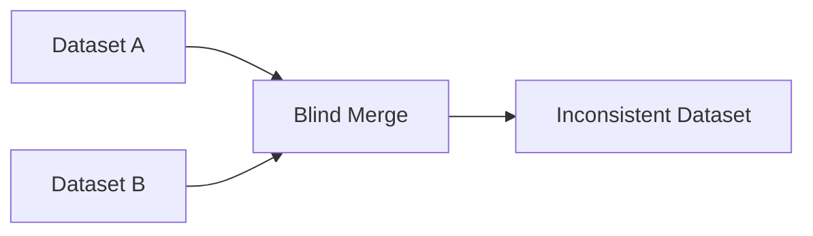
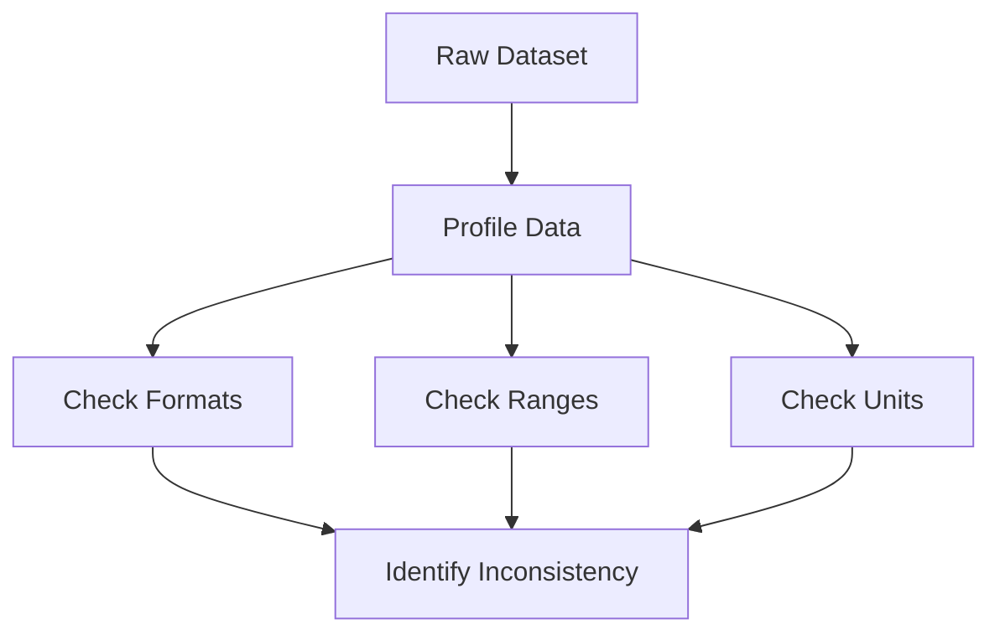
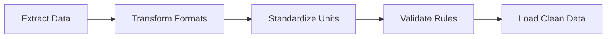

# Index

1. Introduction to Data Inconsistency
    
2. Defining Data Inconsistency
    
3. Examples of Inconsistent Data
    
4. Why Inconsistency Breaks Machine Learning
    
5. Causes of Data Inconsistency
    
6. Types of Inconsistency  
    6.1 Syntactic Inconsistency  
    6.2 Semantic Inconsistency  
    6.3 Structural Inconsistency
    
7. Impact of Inconsistent Data
    
8. Detecting Inconsistency
    
9. Rule-Based Validation Systems
    
10. Visualization-Based Detection
    
11. Resolving Inconsistencies
    
12. ETL and Data Harmonization
    
13. Aadhaar Example and Data Integration Failure
    
14. Key Takeaways
    

# Introduction to Data Inconsistency

Data inconsistency occurs when a dataset contains contradictions, irregularities, or multiple representations of the same information.

Machine learning systems assume that data follows a uniform structure and representation. Once inconsistency enters the dataset, mathematical operations become unreliable and downstream models start producing flawed outputs.

The lecture frames inconsistency as one of the most dangerous preprocessing challenges because it silently corrupts the semantic meaning of data.

# Defining Data Inconsistency

Data inconsistency refers to discrepancies or contradictions inside a dataset.

These inconsistencies may involve:

- Different formats
    
- Different units
    
- Different naming conventions
    
- Different schemas
    
- Contradictory values
    

The core issue is lack of uniformity.

Example:

|Date Column|
|---|
|31-05-2026|
|2026/05/31|

Both represent the same date but follow different formats.

Formally:

$$  
Representation(A) \neq Representation(B)  
$$

even though:

$$  
Meaning(A) = Meaning(B)  
$$

# Examples of Inconsistent Data

The lecture provides multiple practical examples of inconsistency.

## Date Format Inconsistency

|Record|Date|
|---|---|
|A|DD-MM-YYYY|
|B|YYYY/MM/DD|

If algorithms process these values numerically, computations become invalid.

## City Name Inconsistency

|Entry|
|---|
|NY|
|New York|
|ny|

All represent the same city but appear differently.

Distance calculations or encoding procedures may incorrectly treat them as separate categories.

## Unit Inconsistency

|Distance|
|---|
|5 km|
|3 miles|

If merged directly:

$$  
5 \neq 3  
$$

even though both represent comparable measurements under different units.

# Why Inconsistency Breaks Machine Learning

Machine learning algorithms fundamentally depend on mathematical consistency.

Many systems rely on operations such as:

- Euclidean distance
    
- Mean calculation
    
- Similarity comparison
    
- Feature encoding
    
- Statistical aggregation
    

Suppose a model computes Euclidean distance:

d(x,y)=\sqrt{\sum_{i=1}^{n}(x_i-y_i)^2}

If one value is stored in kilometers and another in miles, the calculation becomes misleading because the numerical representations are incompatible.

Similarly, categorical encoding fails when identical entities use inconsistent naming conventions.

The model begins learning artificial distinctions that do not exist in reality.

# Causes of Data Inconsistency

The lecture identifies several practical reasons why inconsistency emerges in real-world systems.

|Cause|Description|
|---|---|
|Human Error|Incorrect manual entry|
|System Glitches|Software-related corruption|
|Data Integration|Merging incompatible datasets|
|Lack of Standards|No common formatting rules|
|Schema Differences|Different database structures|

The most common reason is blind integration of heterogeneous data sources.

# Types of Inconsistency

The lecture categorizes inconsistency into three major forms.

|Type|Meaning|
|---|---|
|Syntactic|Format/type mismatch|
|Semantic|Meaning mismatch|
|Structural|Schema mismatch|

## 6.1 Syntactic Inconsistency

Syntactic inconsistency occurs when the format or datatype changes unexpectedly.

Example:

|Expected Type|Actual Value|
|---|---|
|Text|12345|

or:

|Expected Format|
|---|
|DD-MM-YYYY|

but received:

|Actual Format|
|---|
|YYYY/MM/DD|

The issue is structural formatting rather than meaning.

## 6.2 Semantic Inconsistency

Semantic inconsistency occurs when different values represent the same meaning.

Example:

|Value|
|---|
|NY|
|New York|
|ny|

The semantic meaning is identical, but representation differs.

This creates false categorical separation during encoding and modeling.

## 6.3 Structural Inconsistency

Structural inconsistency occurs when datasets follow different organizational schemes.

Example:

|Dataset A|
|---|
|Distance in Kilometers|

|Dataset B|
|---|
|Distance in Miles|

Blindly merging these structures creates distorted measurements.

Structural inconsistency is particularly common in enterprise data integration pipelines.

# Impact of Inconsistent Data

Inconsistent data reduces system reliability and model accuracy.

Major consequences include:

|Impact|Description|
|---|---|
|Poor Model Accuracy|Incorrect learning patterns|
|Biased Predictions|Skewed inference|
|Business Errors|Faulty decisions|
|Compliance Problems|Regulatory risks|
|Increased Cleaning Cost|Longer preprocessing cycles|

The lecture emphasizes that inconsistency can silently introduce bias into machine learning systems.

# Detecting Inconsistency

One major strategy is data profiling.

Data analysts inspect:

- Distribution patterns
    
- Column formats
    
- Frequency distributions
    
- Type consistency
    
- Data ranges
    

The objective is to identify irregular patterns that violate expected standards.

# Rule-Based Validation Systems

The lecture strongly emphasizes automated rule systems.

## Range Validation

Human age should lie within a realistic range:

$$  
0 \leq Age \leq 120  
$$

If:

$$  
Age = 150  
$$

then the record becomes inconsistent.

## Cross-Field Validation

Suppose:

|Age|Salary|
|---|---|
|12|₹50,000|

The system may define the rule:

$$  
Age < 18 \Rightarrow Salary = 0  
$$

Violation of this rule signals inconsistency.

These validation systems are extremely common in enterprise preprocessing pipelines.

# Visualization-Based Detection

Visualization tools also help identify inconsistencies.

Common tools include:

|Visualization|Purpose|
|---|---|
|Box Plot|Detect abnormal spread|
|Histogram|Detect unusual distributions|
|Scatter Plot|Detect irregular relationships|

Visual analysis helps expose anomalies that may not appear through rule checking alone.

# Resolving Inconsistencies

Data inconsistency is resolved using standardization and cleaning techniques.

Common approaches include:

|Method|Purpose|
|---|---|
|Standardization|Uniform formatting|
|Typo Correction|Fix manual errors|
|Unit Conversion|Align measurements|
|Deduplication|Remove repeated entities|
|Rule Validation|Enforce consistency|

Example:

|Before|After|
|---|---|
|NY|New York|
|ny|New York|

Standardization ensures all representations become uniform.

# ETL and Data Harmonization

The lecture references ETL systems:

- Extract
    
- Transform
    
- Load
    

ETL pipelines transform heterogeneous datasets into a standardized structure before storage or analysis.

ETL systems are critical in enterprise-scale analytics because most organizations collect data from multiple incompatible systems.

# Aadhaar Example and Data Integration Failure

The lecture again references Aadhaar as a real-world example of inconsistency problems.

India already possessed multiple identity systems:

|Existing Systems|
|---|
|PAN|
|Voter ID|
|Passport|
|Ration Card|

In theory, these databases could have been merged.

In practice, inconsistencies across naming conventions, addresses, spellings, and structures made reliable integration extremely difficult.

This forced creation of a centralized biometric identity infrastructure.

The example demonstrates how inconsistency can become a national-scale engineering problem.

# Key Takeaways

Data inconsistency occurs when the same information is represented in multiple incompatible ways.

The lecture emphasizes that inconsistency breaks machine learning systems because mathematical operations assume standardized representations.

Three major forms of inconsistency are discussed:

|Type|
|---|
|Syntactic|
|Semantic|
|Structural|

Detection methods include:

- Data profiling
    
- Rule validation
    
- Cross-field checking
    
- Visualization
    

The most important insight is that inconsistency often emerges during large-scale data integration, making standardization and governance critical components of modern data engineering systems.

Tags: #statistics #machine-learning #data-science #statistical-modelling