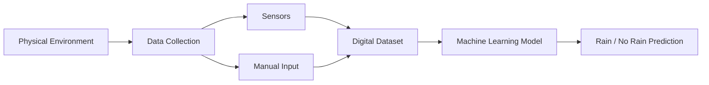
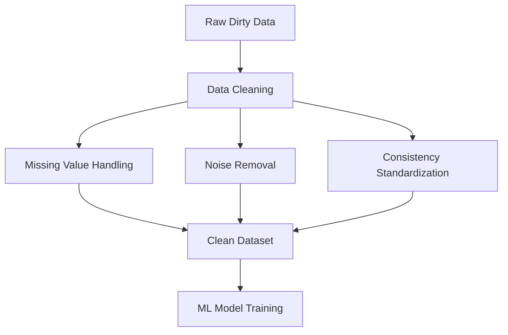

# Index

1. Introduction to Data Cleaning
    
2. Why Real-World Data is Dirty
    
3. Physical World to Digital Data Conversion
    
4. Sources of Dirty Data
    
5. Types of Data Quality Problems  
    5.1 Incomplete Data  
    5.2 Noisy Data  
    5.3 Inconsistent Data
    
6. Why Data Cleaning is Necessary
    
7. Understanding Missing Values
    
8. Missing Values and Machine Learning Failure
    
9. Euclidean Distance and Missing Data
    
10. Methods for Handling Missing Values  
    10.1 Ignoring Tuples  
    10.2 Manual Filling  
    10.3 Global Constants  
    10.4 Local Constants  
    10.5 Central Tendency Methods  
    10.6 Conditional Filling
    
11. Key Takeaways
    

# Introduction to Data Cleaning

Data cleaning is one of the most important stages in machine learning and data preprocessing because real-world data is rarely usable in its raw form.

Before building predictive systems, the collected data must first be cleaned, standardized, validated, and transformed into a reliable format.

The lecture emphasizes that machine learning does not begin with algorithms. It begins with converting messy real-world observations into structured digital data.

# Why Real-World Data is Dirty

Real-world data collection systems are inherently imperfect.

Errors may emerge because of:

- Faulty sensors
    
- Human mistakes
    
- Transmission failures
    
- Missing information
    
- Inconsistent formats
    
- Incorrect measurements
    

As a result, raw datasets often become:

|Problem Type|Meaning|
|---|---|
|Incomplete|Missing values|
|Noisy|Corrupted observations|
|Inconsistent|Non-uniform representation|

The lecture repeatedly stresses that directly training machine learning models on dirty data produces unreliable predictions.

This leads to the classic principle:

$$  
Garbage\ In \Rightarrow Garbage\ Out  
$$

# Physical World to Digital Data Conversion

Machine learning systems first observe physical entities from the real world and then convert them into digital representations.

The lecture uses weather prediction as the core example.

Suppose the question is:

> Will it rain tomorrow?

To answer this question, the system must collect multiple environmental parameters.

|Physical Parameter|Collection Method|
|---|---|
|Humidity|Sensor|
|Wind Speed|Sensor|
|Wind Direction|Sensor|
|Season|Manual or automated entry|
|Cloud Formation|Sensor/Image System|

These physical observations are then transformed into digital tabular data.

# Sources of Dirty Data

During digitalization, multiple types of errors may enter the system.

|Source|Example|
|---|---|
|Sensor Failure|Wrong humidity reading|
|Human Error|Incorrect manual entry|
|Transmission Error|Corrupted signal|
|Aggregated Collection|Missing granularity|
|Data Deletion|Lost records|

The lecture emphasizes that dirty data is the default condition in real-world systems, not the exception.

# Types of Data Quality Problems

The lecture identifies three major forms of dirty data.

|Problem|Description|
|---|---|
|Incomplete Data|Missing attributes or records|
|Noisy Data|Corrupted values|
|Inconsistent Data|Mixed formats or units|

## 5.1 Incomplete Data

Incomplete data means some values or attributes are missing.

Example:

|Customer|Occupation|
|---|---|
|A|NULL|

Missingness may occur at:

- Attribute level
    
- Row level
    
- Dataset level
    

## 5.2 Noisy Data

Noisy data contains corrupted or invalid values.

Example:

|Salary|
|---|
|-10|

A negative salary is unrealistic and therefore represents noise.

Noise typically originates from:

- Human mistakes
    
- Sensor malfunction
    
- Data corruption
    

## 5.3 Inconsistent Data

Inconsistent data occurs when the same attribute uses multiple formats or measurement systems.

Example:

|Height Values|
|---|
|170 cm|
|5.7 feet|

The lack of standardization introduces inconsistency.

# Why Data Cleaning is Necessary

Machine learning algorithms rely on mathematical computations.

If datasets contain missing or corrupted values, many algorithms cannot execute properly.

The preprocessing workflow therefore becomes:

Without cleaning, downstream predictions become unreliable.

# Understanding Missing Values

Missing values occur when information is unavailable for certain observations.

Example:

|Name|Age|Salary|
|---|---|---|
|A|25|50000|
|B|NULL|60000|
|C|40|NULL|

Missing values may occur because:

- Equipment failed
    
- Data was deleted
    
- User refused disclosure
    
- Entry was skipped accidentally
    

# Missing Values and Machine Learning Failure

The lecture explains that many machine learning algorithms depend on mathematical similarity calculations.

One of the most common examples is Euclidean distance.

If values are missing, these computations become impossible.

Suppose:

|Person|Age|Salary|
|---|---|---|
|A|25|50000|
|B|NULL|60000|

The algorithm cannot compute proper similarity because one attribute is absent.

This directly affects:

- Clustering
    
- Classification
    
- Recommendation systems
    
- Similarity matching
    

# Euclidean Distance and Missing Data

The lecture introduces Euclidean distance conceptually.

Distance between two observations is:

d(x,y)=\sqrt{(x_2-x_1)^2+(y_2-y_1)^2}

If one value is missing:

$$  
x_i = NULL  
$$

then subtraction becomes undefined.

This prevents many machine learning algorithms from functioning properly.

The lecture emphasizes that preprocessing is required not just for cleanliness but for mathematical computability itself.

# Methods for Handling Missing Values

The lecture introduces several broad approaches for handling missing values.

|Method|Idea|
|---|---|
|Ignore Tuples|Remove incomplete rows|
|Manual Filling|Human correction|
|Global Constant|Fixed replacement value|
|Local Constant|Context-specific replacement|
|Central Tendency|Mean/median filling|
|Conditional Filling|Rule-based inference|

## 10.1 Ignoring Tuples

The simplest method is deleting rows containing missing values.

Example:

|Name|Age|
|---|---|
|A|25|
|B|NULL|

Row B may simply be removed.

This approach is simple but risks information loss.

## 10.2 Manual Filling

Another approach is manual correction.

A human operator investigates missing values and fills them directly.

Example:

|Name|Missing Attribute|
|---|---|
|B|Age|

The analyst manually retrieves the value from another database or source.

This method is accurate but highly impractical at large scale.

## 10.3 Global Constants

A fixed replacement value may be inserted into missing fields.

Example:

|Missing Age|
|---|
|50|

This strategy assumes a universal replacement value.

Conceptually:

$$  
x_{missing} = C  
$$

where:

- $C$ is a predefined constant
    

## 10.4 Local Constants

Local constants depend on context or subgroup characteristics.

Example:

|Customer Segment|Filled Age|
|---|---|
|Senior Citizens|60|

This is more context-aware than global replacement.

## 10.5 Central Tendency Methods

Missing values may also be filled using statistical summaries.

Common methods include:

|Technique|Formula|
|---|---|
|Mean|Average value|
|Median|Middle value|
|Mode|Most frequent value|

Mean formula:

\bar{x}=\frac{1}{n}\sum_{i=1}^{n}x_i

Example:

|Salary Values|
|---|
|10000|
|12000|
|NULL|

If mean salary is:

$$  
11000  
$$

the missing value may be replaced with 11000.

## 10.6 Conditional Filling

The lecture also introduces rule-based filling.

Example rule:

$$  
Age = 50 \Rightarrow Salary = 10L  
$$

If salary is missing but age is known, the system may infer the missing value using predefined conditions.

This approach incorporates domain knowledge directly into preprocessing.

# Key Takeaways

The lecture emphasizes that dirty data is unavoidable in real-world machine learning systems because physical observations must first be converted into digital representations.

Three major quality problems dominate preprocessing:

|Problem|
|---|
|Missing Data|
|Noisy Data|
|Inconsistent Data|

Missing values are especially important because many machine learning algorithms rely on mathematical computations that cannot execute properly when data is absent.

Several handling strategies exist, ranging from simple row deletion to statistical imputation and conditional inference.

The central engineering insight is that preprocessing is not optional. It is a foundational requirement for building reliable machine learning systems.

Tags: #statistics #machine-learning #data-science #statistical-modelling