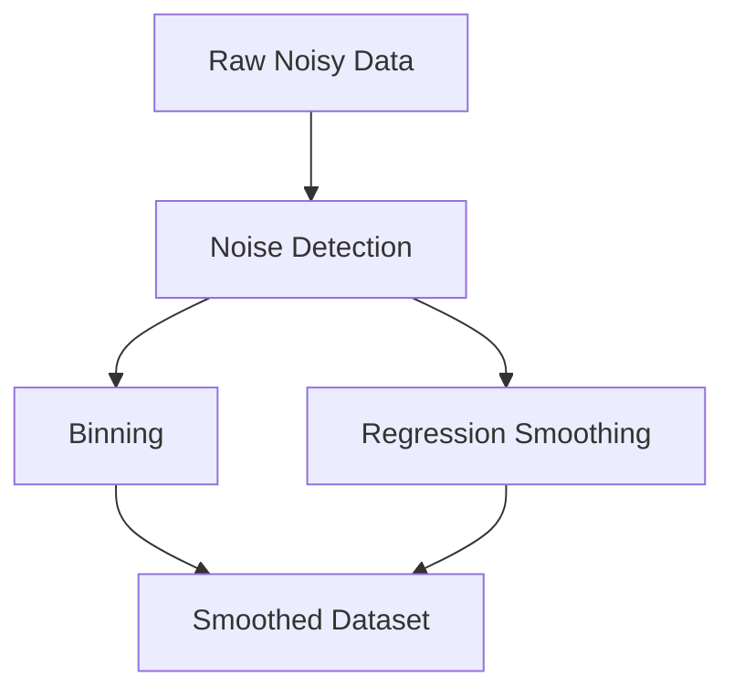
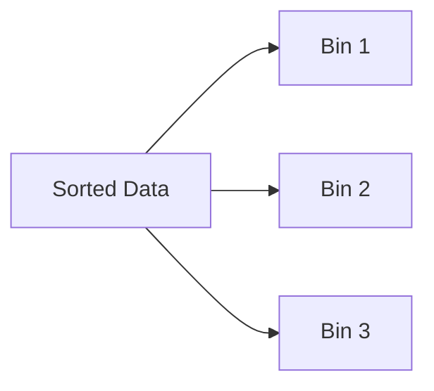
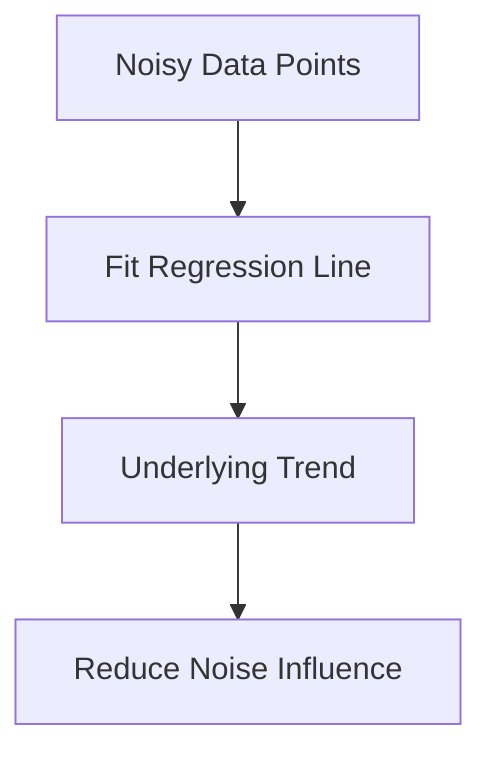

## Index

1. Introduction to Noisy Data
    
2. Understanding Noise in Data
    
3. Causes of Noisy Data
    
4. Irrelevant and Redundant Data
    
5. Poorly Formatted and Unstructured Data
    
6. Outliers and Mislabelled Data
    
7. Noise Handling Techniques
    
8. Binning for Noise Smoothing
    
9. Smoothing by Bin Means
    
10. Smoothing by Bin Boundaries
    
11. Regression-Based Smoothing
    
12. Regression and Trend Modeling
    
13. Key Takeaways
    

## Introduction to Noisy Data

Noisy data refers to random error or unwanted variance introduced into a dataset during collection, transmission, storage, or processing.

In practical machine learning systems, noisy data is unavoidable because real-world observations must first be converted into digital form using sensors, manual entry systems, or communication channels.

The lecture focuses on why noise occurs and how preprocessing techniques such as binning and regression can smooth noisy observations before machine learning models are trained.

## Understanding Noise in Data

Noise represents distortion in the original measured value.

Mathematically:

$$
X_{observed} = X_{true} + \epsilon
$$

where:

- $X_{true}$ is the actual value
    
- $\epsilon$ is random error
    

Noise is therefore not genuine information. It is corruption added during the measurement process.

Unlike outliers, noisy observations are usually not meaningful rare events. They are measurement imperfections.

## Causes of Noisy Data

The lecture identifies multiple practical reasons why noise enters datasets.

|Cause|Example|
|---|---|
|Faulty Sensors|Incorrect humidity measurement|
|Human Error|Mistyped value|
|Transmission Error|Corrupted communication|
|Technological Limitation|Low precision hardware|
|Inconsistent Collection|Different collection standards|

Example:

A sensor designed to measure in meters cannot reliably produce millimeter-level precision.

This technological limitation introduces unavoidable measurement variance.

## Irrelevant and Redundant Data

Noise may also emerge from irrelevant or redundant attributes.

## Irrelevant Features

Certain columns may not contribute meaningfully to prediction.

Example:

|Feature|Loan Approval Relevance|
|---|---|
|Customer Favorite Color|Irrelevant|

If a feature has no relationship with the target variable, it adds unnecessary complexity and statistical noise.

## Redundant Features

Two attributes may encode nearly identical information.

Example:

|Attribute A|Attribute B|
|---|---|
|Height in cm|Height in mm|

Redundant attributes increase dimensionality without improving learning quality.

## Poorly Formatted and Unstructured Data

Noise may also arise due to formatting inconsistency.

Example:

|Date Column|
|---|
|31-05-2026|
|2026/05/31|

Different representations inside the same attribute create irregularity and instability during preprocessing.

This overlaps with data inconsistency problems discussed earlier.

## Outliers and Mislabelled Data

The lecture also mentions that noisy systems may contain:

- Outliers
    
- Misclassified observations
    
- Incorrect labels
    

Example:

|Customer|Loan Status|
|---|---|
|High Risk|Approved|

If labels are incorrect, machine learning systems learn distorted patterns.

This becomes especially dangerous in supervised learning systems where labels define ground truth.

## Noise Handling Techniques

The lecture introduces two major smoothing techniques:

|Method|Core Idea|
|---|---|
|Binning|Local averaging inside groups|
|Regression|Fit trend line/curve|

The goal is not necessarily to remove data points completely, but to reduce the impact of random fluctuations.

## Binning for Noise Smoothing

Binning is one of the simplest smoothing techniques.

The idea is:

1. Sort the data
    
2. Divide it into bins
    
3. Replace values using local statistics
    

This reduces local fluctuation caused by noisy observations.

Suppose the dataset is:

|Original Values|
|---|
|4|
|8|
|15|
|21|
|21|
|24|
|25|
|28|
|34|

After sorting, the data is partitioned into equal-sized bins.

## Smoothing by Bin Means

In bin mean smoothing, each value inside a bin is replaced by the average of that bin.

Suppose:

|Bin 1|
|---|
|4|
|8|
|15|

Mean:

\bar{x}=\frac{4+8+15}{3}=9

The smoothed output becomes:

|Smoothed Bin|
|---|
|9|
|9|
|9|

The idea is that local averaging reduces random variation and stabilizes noisy observations.

## Smoothing by Bin Boundaries

Another approach is boundary smoothing.

Instead of replacing values with the mean, each value is replaced by the nearest boundary value.

Suppose the bin is:

|Values|
|---|
|4|
|8|
|15|

Boundaries:

|Lower Boundary|Upper Boundary|
|---|---|
|4|15|

Now evaluate 8:

$$
|8-4| = 4
$$

$$
|15-8| = 7
$$

Since 8 is closer to 4, it gets replaced with 4.

This method compresses internal variation while preserving edge structure.

## Regression-Based Smoothing

Regression smoothing models the relationship between attributes and then projects noisy observations toward the learned trend.

The lecture uses age and salary as an example.

|Age|Salary|
|---|---|
|20|1000|
|30|2000|
|40|3000|
|50|4000|

A domain expert may identify a relationship:

$$
y = x + 1
$$

where:

- $x$ = age
    
- $y$ = salary
    

The regression model fits a line capturing the underlying trend.

Noisy observations are then adjusted relative to this trend line.

## Regression and Trend Modeling

Regression attempts to estimate the true relationship hidden beneath noisy observations.

Conceptually:

The regression surface may be:

|Type|Shape|
|---|---|
|Linear Regression|Straight line|
|Polynomial Regression|Curve|
|Multivariate Regression|Hyperplane|

The fitted model smooths fluctuations and reveals the dominant structural pattern inside the data.

## Key Takeaways

Noisy data represents random corruption introduced during measurement, collection, transmission, or preprocessing.

The lecture emphasizes that noise may arise not only from faulty sensors but also from irrelevant features, redundant attributes, formatting issues, and mislabelled observations.

Two major smoothing techniques are introduced:

|Technique|Purpose|
|---|---|
|Binning|Local neighborhood smoothing|
|Regression|Trend-based smoothing|

Binning reduces local fluctuations by averaging or boundary replacement, while regression smooths data by modeling the underlying relationship between variables.

The broader engineering lesson is that preprocessing is fundamentally about reducing distortion before machine learning systems begin learning patterns.

Tags: #statistics #machine-learning #data-science #statistical-modelling
