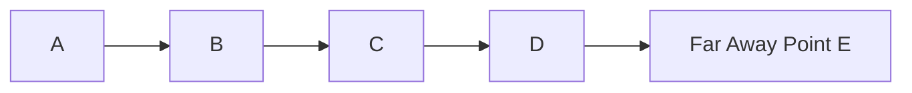
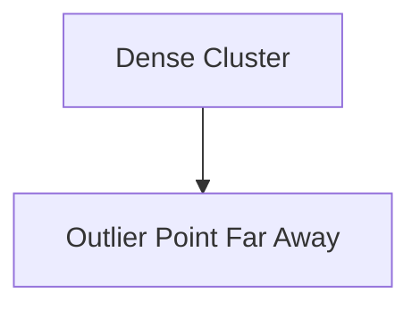
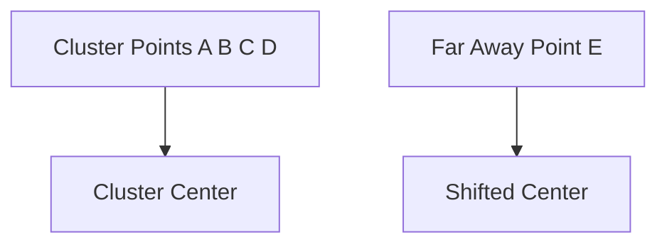
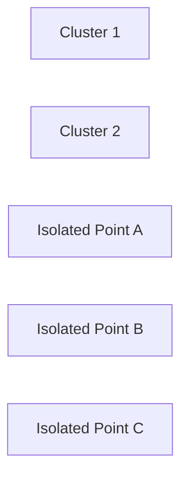
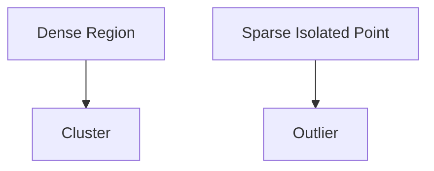
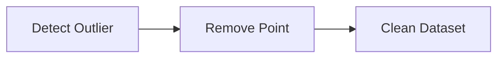
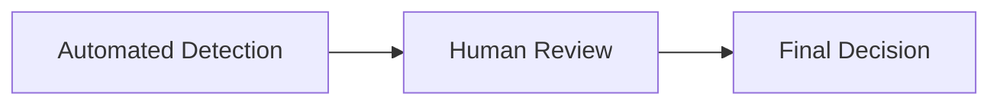
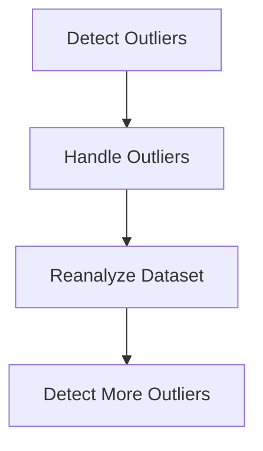

# Index

1. Introduction to Outlier Analysis
    
2. Understanding Outliers
    
3. Visualizing Outliers in 1D and 2D Space
    
4. Distance-Based Intuition Behind Outliers
    
5. Why Outliers Affect Machine Learning
    
6. Outliers and Clustering Algorithms
    
7. Outliers and Statistical Distortion
    
8. Detecting Outliers  
    8.1 Distance-Based Detection  
    8.2 Visualization Methods  
    8.3 Clustering-Based Detection  
    8.4 Density-Based Detection
    
9. DBSCAN and Density-Based Clustering
    
10. Handling Outliers  
    10.1 Direct Removal  
    10.2 Transformation and Replacement  
    10.3 Automated Detection Methods  
    10.4 Domain Expert Validation
    
11. Median vs Mean for Robustness
    
12. Outlier Detection in High Dimensions
    
13. Iterative Nature of Outlier Analysis
    
14. Real-World Importance of Outliers
    
15. Key Takeaways
    

# Introduction to Outlier Analysis

Outlier analysis focuses on identifying data points that differ significantly from the majority of observations in a dataset.

The lecture emphasizes an extremely important distinction:

> Outliers are genuine data points.

They are not necessarily noise or errors. They are real observations that happen to be unusually distant from normal behavior.

Outlier analysis becomes critical because many machine learning and statistical systems are highly sensitive to extreme observations.

# Understanding Outliers

An outlier is a genuine observation that deviates significantly from the majority of data points.

Suppose we have a one-dimensional dataset:

|Points|
|---|
|A|
|B|
|C|
|D|
|E|

Points A, B, C, and D are close together, while E lies far away.

Conceptually:

$$  
Distance(E,\text{Other Points}) \gg \text{Average Distance}  
$$

This makes E an outlier.

The same intuition extends into higher-dimensional spaces.

# Visualizing Outliers in 1D and 2D Space

The lecture explains outliers using both one-dimensional and two-dimensional examples.

## One-Dimensional View

Point E is isolated from the rest of the distribution.

## Two-Dimensional View

In two-dimensional space, most observations form a dense cluster while the outlier remains isolated.

The key property is:

$$  
Similarity \downarrow \quad as \quad Distance \uparrow  
$$

# Distance-Based Intuition Behind Outliers

The lecture introduces a simple intuitive method for understanding outliers.

Suppose distances between nearby points are small:

|Pair|Distance|
|---|---|
|A-B|1|
|B-C|1|
|C-D|1|

But:

|Pair|Distance|
|---|---|
|D-E|5|

The average distance from E to the remaining points becomes significantly larger.

This suggests:

$$  
\text{Average Distance}(E) \gg \text{Average Distance of Other Points}  
$$

Outlier detection methods often rely fundamentally on this idea.

# Why Outliers Affect Machine Learning

Outliers can heavily distort machine learning systems because many algorithms depend on:

- Means
    
- Distances
    
- Cluster centers
    
- Statistical distributions
    

The lecture emphasizes that outliers may:

- Skew predictions
    
- Distort statistical analysis
    
- Mask true trends
    
- Shift cluster centers
    

This becomes especially dangerous in clustering systems.

# Outliers and Clustering Algorithms

The lecture specifically discusses center-based clustering algorithms.

Suppose:

Without the outlier, the cluster center lies near the dense region.

Once the outlier is included, the center shifts unnaturally.

This affects algorithms such as:

|Algorithm|Sensitivity|
|---|---|
|K-Means|High|
|Agglomerative Clustering|High|

Cluster centroids are computed using averages:

Centroid=\frac{1}{n}\sum_{i=1}^{n}x_i

Extreme points therefore distort the center significantly.

# Outliers and Statistical Distortion

Outliers can distort statistical summaries as well.

Example:

|Values|
|---|
|10|
|12|
|11|
|500|

Mean becomes:

\bar{x}=\frac{10+12+11+500}{4}

The extreme value dominates the average.

This is why outliers can mask true trends within the data.

# Detecting Outliers

The lecture introduces several detection methods.

|Method|Core Idea|
|---|---|
|Distance-Based|Measure similarity|
|Visualization|Plot abnormal points|
|Clustering|Identify isolated points|
|Density-Based|Detect sparse regions|

## 8.1 Distance-Based Detection

The simplest method is calculating pairwise distances.

If a point remains significantly farther from all others:

$$  
Distance(x_i,x_j) \uparrow  
$$

then the point may be an outlier.

This approach works well in low-dimensional datasets.

## 8.2 Visualization Methods

Visualization techniques make outlier identification intuitive.

Common methods include:

|Visualization|Purpose|
|---|---|
|Scatter Plot|Detect isolated observations|
|Box Plot|Detect extreme spread|
|Histogram|Detect unusual frequency|

These methods work effectively in 1D and 2D spaces.

## 8.3 Clustering-Based Detection

Clustering algorithms group similar observations together.

Points outside cluster boundaries become potential outliers.

The isolated points do not belong naturally to any dense group.

## 8.4 Density-Based Detection

Density-based methods examine local point concentration.

Dense regions represent normal behavior.

Sparse isolated regions represent anomalies.

This approach is more robust than center-based methods.

# DBSCAN and Density-Based Clustering

The lecture highlights DBSCAN as an important density-based clustering algorithm.

Unlike K-Means, DBSCAN does not rely on cluster centers.

Instead, it identifies dense neighborhoods.

Advantages:

|Property|DBSCAN|
|---|---|
|Center-Based|No|
|Sensitive to Outliers|Less|
|Detects Arbitrary Shapes|Yes|
|Detects Noise Naturally|Yes|

DBSCAN naturally separates sparse points as outliers.

# Handling Outliers

Once identified, outliers may be handled using multiple strategies.

|Method|Description|
|---|---|
|Removal|Delete outlier|
|Replacement|Substitute new value|
|Transformation|Reduce influence|
|Isolation|Handle separately|

## 10.1 Direct Removal

The simplest strategy is deleting the outlier from the dataset.

This reduces distortion but risks losing valuable information.

## 10.2 Transformation and Replacement

Instead of deleting the point, the system may replace it using:

- Mean
    
- Median
    
- Nearest non-outlier value
    

This preserves dataset size and structure.

Example:

|Original Value|Replaced Value|
|---|---|
|500|15|

## 10.3 Automated Detection Methods

The lecture mentions advanced automated techniques.

|Method|Purpose|
|---|---|
|Isolation Forest|Large-scale anomaly detection|
|One-Class SVM|High-dimensional anomaly detection|
|Local Outlier Factor|Density deviation analysis|

These methods are useful when datasets contain hundreds or thousands of dimensions.

## 10.4 Domain Expert Validation

Outlier analysis is not purely mathematical.

Domain experts help determine whether an anomaly is:

- Genuine
    
- Fraudulent
    
- Critical
    
- Meaningful
    
- Erroneous
    

This hybrid approach combines:

# Median vs Mean for Robustness

The lecture emphasizes that mean is highly sensitive to outliers while median is more robust.

Example:

|Values|
|---|
|10|
|11|
|12|
|500|

Mean shifts dramatically.

Median remains relatively stable.

This is why robust statistical systems often prefer median-based approaches in the presence of outliers.

# Outlier Detection in High Dimensions

In low-dimensional spaces, outliers can often be visualized directly.

However, real-world datasets may contain:

- Hundreds of attributes
    
- Thousands of dimensions
    

In such environments:

- Visualization becomes impossible
    
- Distance calculations become expensive
    

The lecture notes that high-dimensional outlier analysis often requires automated algorithms such as:

- Isolation Forest
    
- One-Class SVM
    
- LOF
    

because traditional distance calculations scale poorly.

# Iterative Nature of Outlier Analysis

Outlier analysis is not a one-time preprocessing step.

The workflow becomes iterative:

The dataset must repeatedly be reviewed and refined.

# Real-World Importance of Outliers

The lecture highlights an important warning:

> Removing outliers blindly may destroy valuable information.

Examples where outliers are important:

|Domain|Meaning of Outlier|
|---|---|
|Fraud Detection|Suspicious transaction|
|Cybersecurity|Intrusion attempt|
|Medicine|Rare disease|
|Finance|Market crash|
|Manufacturing|Equipment failure|

Sometimes the outlier is the most important observation in the dataset.

# Key Takeaways

Outliers are genuine observations that differ significantly from the majority of the dataset.

The lecture emphasizes that outliers strongly affect clustering algorithms, statistical summaries, and machine learning systems because many algorithms depend on distances and averages.

Several detection approaches are discussed:

|Method|
|---|
|Distance-Based|
|Visualization|
|Clustering|
|Density-Based|
|Isolation Forest|
|One-Class SVM|

The most important conceptual insight is that outliers are not necessarily bad data. In many real-world systems, they represent the most meaningful and actionable events.