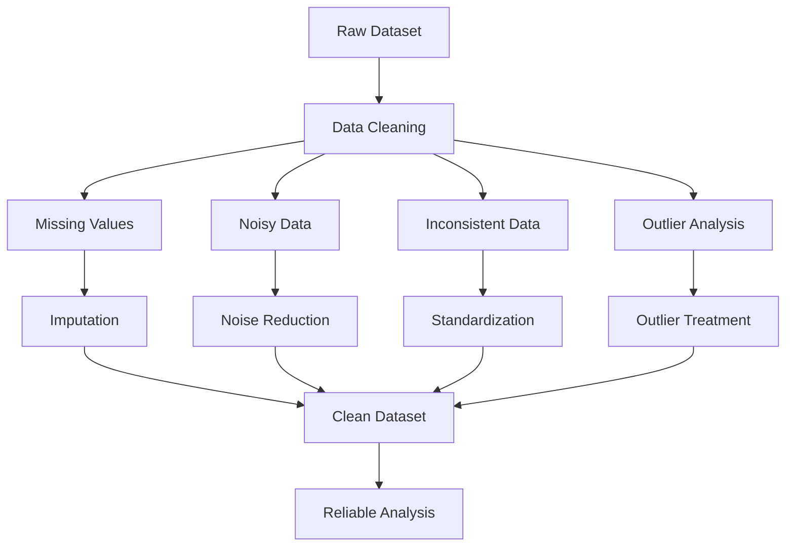

# Lesson 2: Data Cleaning Techniques

## Overview

Data collected from real-world environments is often incomplete, inconsistent, inaccurate, or corrupted by random errors. Such imperfections can significantly affect statistical analysis, data mining, and machine learning outcomes.

Data cleaning is the process of detecting, correcting, or removing these imperfections to improve the quality and reliability of datasets.

This lesson focuses on some of the most common data cleaning challenges encountered in practice, including missing values, noisy data, inconsistent data, and outliers. It also introduces practical techniques for identifying and handling these issues using analytical methods and Python-based implementations.

Mastering these concepts is essential for developing robust, accurate, and trustworthy analytical models.

## Learning Objectives

After completing this lesson, you should be able to:

- Identify various forms of data quality issues.
- Explain the causes and impact of missing values.
- Detect and handle inconsistent data.
- Understand the nature of noisy data and methods for noise reduction.
- Identify and analyze outliers using statistical techniques.
- Apply suitable outlier handling methods.
- Perform practical data cleaning tasks using Python.

## Topics Covered

### 1. [Missing Values](Missing%20Values.md)

Missing values occur when information is unavailable or absent for certain observations within a dataset.

Common causes include:

- Data entry mistakes
- Equipment or sensor failures
- Survey non-responses
- Data integration problems
- Human errors

Typical representations include:

- `NULL`
- `NaN`
- Empty strings
- Placeholder values

Common techniques for handling missing values include:

- Deleting records
- Mean/Median imputation
- Mode imputation
- Predictive imputation
- Interpolation

Proper handling of missing values is crucial for maintaining analytical accuracy.

### 2. [Noisy DATA](Noisy%20DATA.md)

Noise refers to random errors or meaningless variations that distort the true underlying patterns within data.

Sources of noise include:

- Measurement errors
- Typographical mistakes
- Sensor inaccuracies
- Transmission errors
- Human mistakes

Examples:

- Incorrect age values
- Misspelled categories
- Invalid measurements

Common noise reduction techniques include:

- Smoothing
- Binning
- Regression techniques
- Clustering
- Filtering methods

Reducing noise improves model reliability and predictive performance.

### 3. [Inconsistent Data](Inconsistent%20Data.md)

Data inconsistency occurs when similar information is represented differently across records or systems.

Examples include:

| Inconsistent Values | Standardized Value |
|---------------------|-------------------|
| Male, M, male | Male |
| USA, U.S., United States | United States |
| 12/05/25, 2025-05-12 | Standard Date Format |

Common causes include:

- Multiple data sources
- Lack of standardization
- Human data entry errors
- System integration issues

Resolving inconsistencies ensures data uniformity and improves analytical reliability.

### 4. [Outlier Analysis](Outlier%20Analysis.md)

Outliers are observations that significantly differ from the majority of data points.

Outliers may arise due to:

- Measurement errors
- Data entry mistakes
- Fraudulent activities
- Rare but genuine events

Examples:

- Unusually large financial transactions
- Abnormally high temperatures
- Extreme customer purchase amounts

Outlier analysis aims to:

- Detect unusual observations
- Determine their causes
- Decide whether they should be retained or removed

Outlier analysis is especially important in fraud detection, healthcare, finance, and anomaly detection systems.

### 5. [Identifying & Handling Outliers](Identifying%20%26%20Handling%20Outliers.md)

This topic focuses on practical techniques used to identify and manage outliers.

Common detection methods include:

#### Statistical Techniques

- Z-Score Method
- Interquartile Range (IQR) Method

#### Visualization Techniques

- Box Plots
- Scatter Plots
- Histograms

#### Machine Learning Techniques

- Isolation Forest
- DBSCAN
- Local Outlier Factor (LOF)

Common handling strategies include:

- Removal
- Capping
- Transformation
- Winsorization
- Retaining valid extreme values

Selecting the appropriate treatment depends on the nature and business significance of the outlier.

### 6. [Lab 4.1: Data Cleaning Missing Values Lab](Lab%204.1%20data%20cleaning%20missing%20values%20lab.ipynb)

This practical lab provides hands-on experience in identifying and handling missing values using Python.

Activities may include:

- Detecting missing values using Pandas
- Quantifying missingness
- Visualizing missing data
- Applying imputation techniques
- Evaluating the impact of missing value treatments

The lab demonstrates practical implementation of theoretical concepts.

### 7. [Lab 4.2: Analysis and Removal Techniques of Outliers](Lab%204.2_%20Analysis%20and%20removal%20techniques%20of%20outliers%20from%20dataset.ipynb)

This laboratory exercise focuses on practical outlier analysis and treatment techniques.

Activities may include:

- Visualizing distributions
- Detecting outliers using box plots
- Applying Z-Score analysis
- Applying IQR-based methods
- Removing or capping outliers
- Comparing datasets before and after treatment

The lab bridges theory and practical implementation using real datasets.

## Conceptual Relationship

## Lesson Navigation

| Resource | Description |
|-----------|-------------|
| 📄 [Missing Values](Missing%20Values.md) | Understand causes and treatment methods for missing data |
| 📄 [Noisy DATA](Noisy%20DATA.md) | Learn about random errors and noise reduction techniques |
| 📄 [Inconsistent Data](Inconsistent%20Data.md) | Explore causes and handling of inconsistent information |
| 📄 [Outlier Analysis](Outlier%20Analysis.md) | Introduction to outliers and their analytical significance |
| 📄 [Identifying & Handling Outliers](Identifying%20%26%20Handling%20Outliers.md) | Techniques for detecting and managing outliers |
| 📓 [Lab 4.1: Data Cleaning Missing Values Lab](Lab%204.1%20data%20cleaning%20missing%20values%20lab.ipynb) | Practical exercises on missing value handling |
| 📓 [Lab 4.2: Analysis and Removal Techniques of Outliers](Lab%204.2_%20Analysis%20and%20removal%20techniques%20of%20outliers%20from%20dataset.ipynb) | Practical exercises on outlier analysis and treatment |

## Key Takeaways

- Real-world datasets frequently contain missing, noisy, inconsistent, and extreme values.
- Data cleaning is essential for ensuring reliable analytical outcomes.
- Missing values require careful treatment to avoid biased analysis.
- Noise and inconsistencies can significantly degrade model performance.
- Outliers should be analyzed carefully before removal since some may represent valuable information.
- Effective data cleaning improves data quality, model performance, and decision-making accuracy.

## Prerequisites for Future Topics

The concepts introduced in this lesson provide the foundation for:

- Data Transformation
- Feature Engineering
- Exploratory Data Analysis (EDA)
- Statistical Modeling
- Machine Learning
- Data Mining
- Predictive Analytics
- Anomaly Detection
