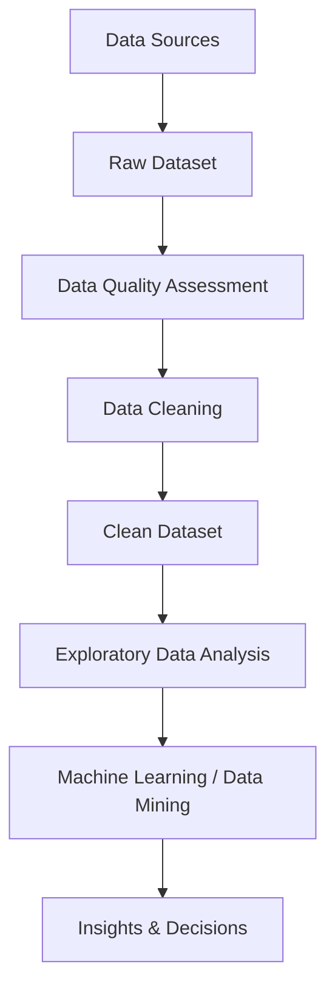

# Week 4: Data Cleaning

## Overview

Data cleaning is one of the most important stages in the data preprocessing pipeline. Real-world data is often incomplete, inconsistent, noisy, duplicated, or incorrectly formatted. Before performing any statistical analysis, data mining, or machine learning, these issues must be identified and corrected.

Poor-quality data can lead to inaccurate conclusions, biased models, and unreliable business decisions. Data cleaning addresses these challenges by transforming raw data into a consistent, accurate, and usable form.

This week introduces the fundamental tasks involved in data processing and data cleaning. These tasks provide the foundation for building high-quality datasets that can support reliable analytical and predictive models.

## Learning Objectives

After completing this week, you should be able to:

- Understand the importance of data cleaning in the data preprocessing pipeline.
- Explain the major tasks involved in data processing.
- Identify common data cleaning activities.
- Recognize how data cleaning improves analytical outcomes.
- Understand the relationship between data quality and data cleaning.
- Apply appropriate techniques to prepare datasets for analysis.

## Topics Covered

### 1. [Task in Data Processing](Task%20in%20Data%20Processing.md)

Data processing involves a series of activities designed to convert raw data into meaningful and reliable information.

This topic introduces the major tasks commonly performed during data processing, including:

#### Data Collection

The process of gathering data from various internal and external sources.

Examples include:

- Databases
- Sensors
- Surveys
- Web applications
- Transactional systems

#### Data Cleaning

The process of detecting and correcting errors within datasets.

Common cleaning tasks include:

- Handling missing values
- Removing duplicate records
- Correcting inconsistencies
- Detecting outliers
- Eliminating noise

#### Data Integration

Combining data from multiple sources into a unified dataset.

Examples:

- Merging customer information from different systems
- Combining sales and marketing datasets

#### Data Transformation

Converting data into suitable formats for analysis.

Examples:

- Normalization
- Standardization
- Aggregation
- Encoding categorical variables

#### Data Reduction

Reducing data volume while preserving essential information.

Examples:

- Feature selection
- Dimensionality reduction
- Sampling

#### Data Presentation and Analysis

Preparing processed data for reporting, visualization, and advanced analytical tasks.

Examples:

- Dashboards
- Statistical analysis
- Machine learning models

## Conceptual Relationship

## Week Navigation

| Resource | Description |
|-----------|-------------|
| 📄 [Task in Data Processing](Task%20in%20Data%20Processing.md) | Overview of the major activities involved in processing and preparing data for analysis |
| 📁 [L2](L2/) | Additional lesson materials and practical content related to data cleaning |

## Why Data Cleaning Matters

Data cleaning is often considered the most time-consuming stage of a Data Science project.

Studies suggest that data professionals may spend a significant portion of their time preparing and cleaning data before performing analysis.

Effective data cleaning helps:

- Improve data accuracy.
- Increase model performance.
- Reduce analytical errors.
- Enhance decision-making quality.
- Improve trust in analytical systems.

Without proper data cleaning, even sophisticated machine learning algorithms may produce misleading results.

## Conceptual Pipeline

## Key Takeaways

- Data cleaning is a critical component of data preprocessing.
- Raw data frequently contains errors and inconsistencies.
- Data processing involves collection, cleaning, integration, transformation, reduction, and analysis.
- Clean data leads to more reliable analytical and predictive outcomes.
- Effective preprocessing significantly improves the quality of machine learning models.

## Prerequisites for Future Topics

The concepts introduced in this week provide the foundation for:

- Handling Missing Values
- Outlier Detection
- Data Transformation
- Feature Engineering
- Exploratory Data Analysis (EDA)
- Machine Learning
- Data Mining
- Statistical Modeling
