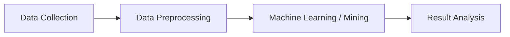
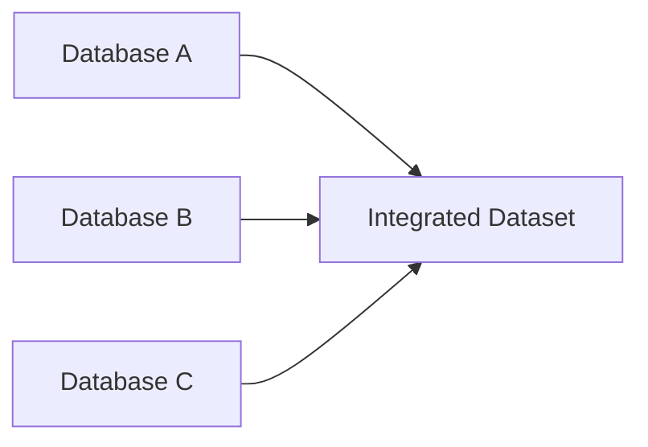
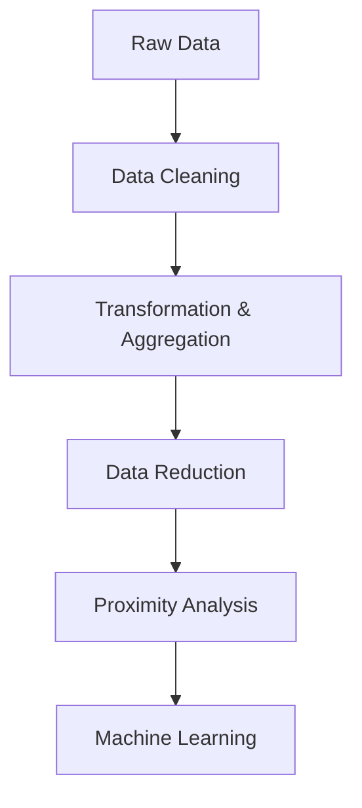

# Index

1. Introduction to Data Preprocessing
    
2. Why Data Preprocessing is Necessary
    
3. Position of Preprocessing in the Data Science Pipeline
    
4. Goals of Data Preprocessing
    
5. Major Data Preprocessing Tasks
    
6. Data Cleaning  
    6.1 Missing Values  
    6.2 Noisy Data  
    6.3 Outlier Analysis  
    6.4 Data Inconsistency
    
7. Data Transformation and Aggregation  
    7.1 Data Normalization  
    7.2 Data Aggregation  
    7.3 Data Integration
    
8. Data Reduction  
    8.1 Row Reduction  
    8.2 Attribute Reduction  
    8.3 Curse of Dimensionality
    
9. Proximity Measures
    
10. Types of Similarity Analysis
    
11. Overall Data Preprocessing Workflow
    
12. Key Takeaways
    

# Introduction to Data Preprocessing

Data preprocessing is the first major stage in any machine learning or data science workflow after data collection.

The lecture emphasizes a foundational principle:

$$  
Poor\ Quality\ Data \Rightarrow Poor\ Quality\ Analysis  
$$

If raw data contains missing values, inconsistencies, noise, or irrelevant information, then predictive and descriptive systems built on top of that data will also become unreliable.

The goal of preprocessing is therefore to transform raw data into a form suitable for analysis and machine learning.

# Why Data Preprocessing is Necessary

Real-world data is almost always imperfect.

Common problems include:

|Problem|Meaning|
|---|---|
|Missing Values|Data absent|
|Noisy Data|Corrupted observations|
|Outliers|Extreme observations|
|Inconsistency|Mixed formats/units|
|Redundant Features|Duplicate information|

Without preprocessing:

- Models become unstable
    
- Statistical analysis becomes misleading
    
- Training cost increases
    
- Prediction quality decreases
    

The lecture frames preprocessing as a quality-improvement stage before machine learning begins.

# Position of Preprocessing in the Data Science Pipeline

The lecture connects preprocessing to the KDD pipeline.

The workflow becomes:

Raw collected data cannot usually be passed directly into machine learning systems.

Preprocessing acts as the bridge between data collection and intelligent analysis.

# Goals of Data Preprocessing

The lecture defines two central objectives.

|Goal|Purpose|
|---|---|
|Improve Data Quality|Remove defects|
|Modify Data Structure|Fit analytical requirements|

This means preprocessing is not only about cleaning data.

It is also about transforming the dataset into a mathematically and computationally suitable format for downstream algorithms.

# Major Data Preprocessing Tasks

The lecture divides preprocessing into four major categories.

|Task|Purpose|
|---|---|
|Data Cleaning|Fix quality issues|
|Data Transformation & Aggregation|Rescale and restructure|
|Data Reduction|Reduce dimensionality/volume|
|Proximity Analysis|Measure similarity|

These form the foundation of the remaining preprocessing modules.

# Data Cleaning

Data cleaning focuses on detecting and correcting poor-quality data.

The lecture identifies four major cleaning problems.

|Cleaning Problem|Example|
|---|---|
|Missing Values|Age not provided|
|Noisy Data|Wrong measurement|
|Outliers|Extreme isolated point|
|Inconsistency|Mixed measurement units|

## 6.1 Missing Values

Missing values occur when information is unavailable.

Example:

|Name|Age|
|---|---|
|A|25|
|B|NULL|

The lecture uses survey-style data collection where individuals may refuse disclosure.

Missing data becomes problematic because many algorithms require complete mathematical input.

## 6.2 Noisy Data

Noisy data contains corrupted observations.

Example:

|Actual Age|Recorded Age|
|---|---|
|50|70|

The corruption may arise because of:

- Human entry mistakes
    
- Sensor failure
    
- Transmission error
    

Noise distorts learning patterns.

## 6.3 Outlier Analysis

Outliers are extreme observations significantly different from the majority of data points.

Outliers may:

- Distort cluster centers
    
- Shift averages
    
- Skew regression lines
    

This makes outlier detection essential before model training.

## 6.4 Data Inconsistency

Inconsistency occurs when the same attribute uses multiple formats or units.

Example:

|Height|
|---|
|170 cm|
|5.7 feet|

Machine learning systems assume standardization.

Mixed units therefore produce invalid computations.

# Data Transformation and Aggregation

Transformation modifies the representation of data into a more suitable analytical form.

The lecture discusses three major transformation tasks.

|Transformation Task|Purpose|
|---|---|
|Normalization|Scale balancing|
|Aggregation|Summarization|
|Integration|Merge multiple sources|

## 7.1 Data Normalization

Normalization becomes necessary when attributes operate on drastically different numerical scales.

Example:

|Attribute|Typical Range|
|---|---|
|Age|1–100|
|Salary|10,000–1,000,000|

Without normalization:

$$  
Salary \gg Age  
$$

Large-scale attributes dominate mathematical calculations.

Normalization rescales attributes to comparable ranges.

## 7.2 Data Aggregation

Aggregation summarizes detailed data into higher-level representations.

Example:

|Original Data|Aggregated Form|
|---|---|
|Daily Sales|Monthly Sales|
|Hourly Weather|Weekly Weather|

Aggregation helps produce macro-level insights and reduce data complexity.

## 7.3 Data Integration

Data integration combines information from multiple sources.

Example:

The challenge is ensuring consistency during merging.

# Data Reduction

Data reduction decreases dataset size while preserving useful information.

The lecture divides reduction into:

|Reduction Type|Goal|
|---|---|
|Row Reduction|Reduce observations|
|Attribute Reduction|Reduce features|

## 8.1 Row Reduction

Some observations may be unnecessary or redundant.

Reduction methods such as sampling decrease dataset volume while preserving statistical properties.

This improves training efficiency.

## 8.2 Attribute Reduction

Not all features contribute meaningfully to prediction.

Feature selection removes irrelevant or redundant attributes.

Example:

|Useful Feature|Irrelevant Feature|
|---|---|
|Salary|Favorite Color|

Reducing dimensions simplifies learning.

## 8.3 Curse of Dimensionality

The lecture references the curse of dimensionality.

As feature count increases:

$$  
Dimensions \uparrow \Rightarrow Computational\ Cost \uparrow  
$$

Training complexity grows rapidly.

Example:

|Dataset|Difficulty|
|---|---|
|5 Features|Manageable|
|5000 Features|Extremely Expensive|

High-dimensional systems become harder to train and analyze.

# Proximity Measures

Proximity analysis measures similarity or distance between observations.

This becomes fundamental in:

- Clustering
    
- Recommendation systems
    
- Classification
    
- Pattern recognition
    

The lecture introduces proximity as a major preprocessing concept.

# Types of Similarity Analysis

Different data types require different similarity measures.

|Attribute Type|Similarity Strategy|
|---|---|
|Nominal|Category matching|
|Binary|Presence/absence comparison|
|Numerical|Distance metrics|
|Ordinal|Rank comparison|
|Mixed|Hybrid methods|

Similarity analysis depends heavily on datatype characteristics.

# Overall Data Preprocessing Workflow

The complete preprocessing pipeline becomes:

Each stage progressively improves data usability and computational suitability.

# Key Takeaways

Data preprocessing is the foundational stage between raw data collection and machine learning.

The lecture introduces four major preprocessing categories:

|Category|
|---|
|Data Cleaning|
|Data Transformation & Aggregation|
|Data Reduction|
|Proximity Analysis|

The broader engineering insight is that machine learning performance depends heavily on preprocessing quality because algorithms assume mathematically valid, structured, and meaningful input data.

Preprocessing therefore is not a minor cleanup activity. It is a core engineering discipline within practical AI and data science systems.