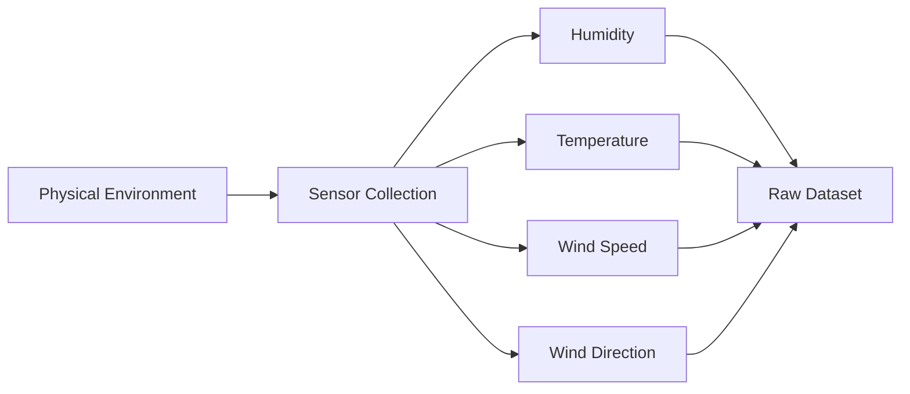
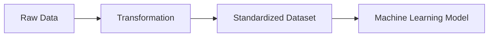
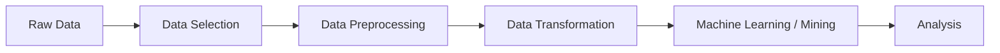
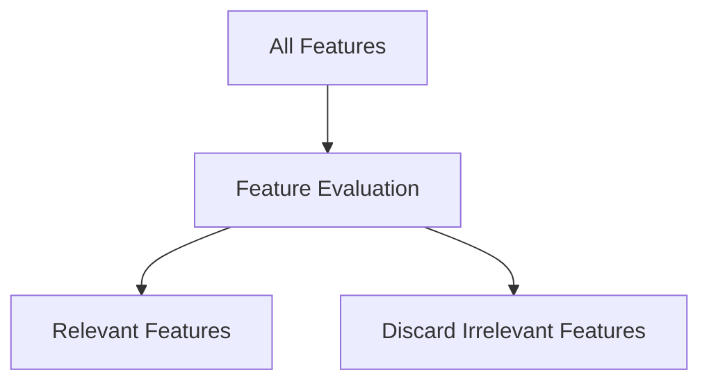
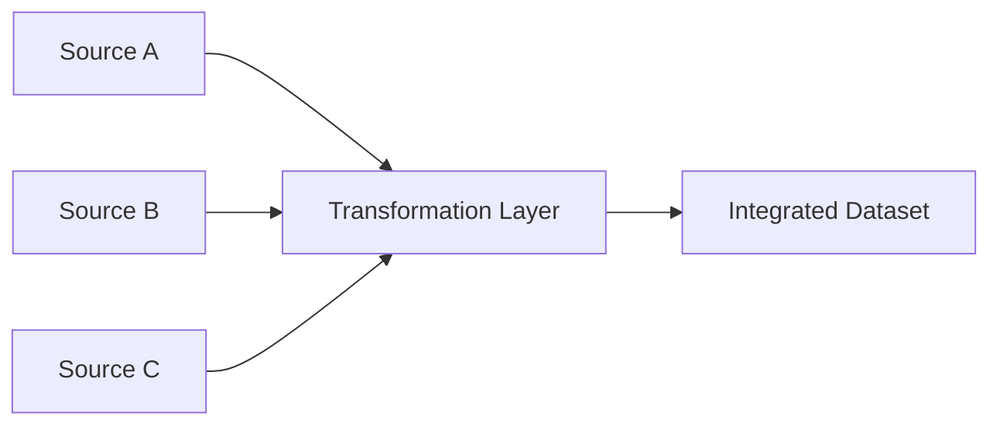
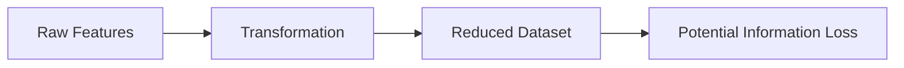
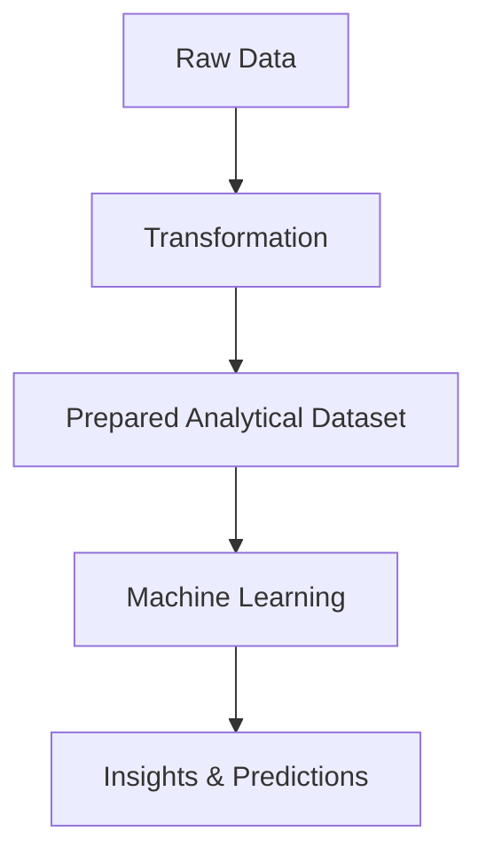

## Index

1. Introduction to Data Transformation
    
2. Defining Data Transformation
    
3. Weather Prediction Example
    
4. Raw Data vs Transformed Data
    
5. Role of Data Transformation in the KDD Pipeline
    
6. Purpose of Data Transformation
    
7. Improving Data Quality Through Transformation
    
8. Reducing Complexity in Machine Learning
    
9. Feature Selection and Attribute Subselection
    
10. Standardization and Uniformity
    
11. Data Integration Challenges
    
12. Benefits of Data Transformation
    
13. Challenges in Data Transformation
    
14. Information Loss Problem
    
15. Computational Cost of Transformation
    
16. Bias and Overfitting Risks
    
17. Interpretability and Strategic Value
    
18. Data Transformation as a Foundational Step
    
19. Future Transformation Topics
    
20. Key Takeaways
    

## Introduction to Data Transformation

Data transformation is one of the most important stages in data preprocessing because raw collected data is rarely suitable for direct machine learning or analytical modeling.

The lecture emphasizes that real-world datasets are usually:

- Unstructured
    
- Inconsistent
    
- High-dimensional
    
- Noisy
    
- Collected from heterogeneous sources
    

Transformation converts this raw information into a mathematically and computationally usable format.

## Defining Data Transformation

Data transformation is the process of converting raw data into a format that is more suitable for analysis, machine learning, and modeling tasks.

Formally:

$$
Raw\ Data \xrightarrow{Transformation} Structured\ Analytical\ Data
$$

The transformed dataset becomes easier for machine learning systems to process because:

- scales become standardized
    
- inconsistencies are reduced
    
- irrelevant information is minimized
    
- useful patterns become clearer
    

The lecture frames transformation as a bridge between raw physical measurements and intelligent predictive systems.

## Weather Prediction Example

The lecture repeatedly uses weather prediction to explain transformation intuitively.

Suppose the objective is:

> Predict whether it will rain tomorrow.

To answer this, multiple environmental variables must be collected.

|Parameter|Source|
|---|---|
|Humidity|Sensor|
|Temperature|Sensor|
|Wind Speed|Sensor|
|Wind Direction|Sensor|

The system gathers these physical measurements from the environment and stores them digitally.

## Raw Data vs Transformed Data

The lecture highlights that raw collected values often operate on completely different scales.

Example:

|Feature|Example Scale|
|---|---|
|Humidity|0–100|
|Temperature|20–40|
|Wind Speed|Thousands|
|Wind Direction|Angular values|

Directly building machine learning models on such heterogeneous scales may produce unstable learning behavior.

Transformation therefore restructures the dataset into a more balanced and analyzable representation.

## Role of Data Transformation in the KDD Pipeline

The lecture connects transformation to the KDD pipeline.

The overall workflow becomes:

Transformation prepares the dataset for downstream learning algorithms.

It is therefore an intermediate but foundational stage.

## Purpose of Data Transformation

The lecture identifies multiple transformation objectives.

|Objective|Purpose|
|---|---|
|Improve Quality|Reduce defects|
|Standardize Data|Uniform representation|
|Reduce Complexity|Simplify learning|
|Improve Accuracy|Better modeling|
|Enable Integration|Merge multiple sources|

The transformed dataset becomes more reliable and computationally manageable.

## Improving Data Quality Through Transformation

Transformation improves dataset quality by addressing multiple issues simultaneously.

The lecture mentions:

- Missing values
    
- Noise
    
- Outliers
    
- Redundancy
    
- Inconsistency
    

Example:

|Before Transformation|After Transformation|
|---|---|
|Mixed units|Standardized units|
|Duplicate columns|Reduced redundancy|
|Missing values|Imputed values|

Transformation therefore overlaps heavily with cleaning operations.

## Reducing Complexity in Machine Learning

One major purpose of transformation is reducing modeling complexity.

Raw datasets may contain:

- Irrelevant attributes
    
- Duplicate information
    
- Excessive dimensions
    
- High computational cost
    

Transformation simplifies the learning space.

The lecture emphasizes:

$$
Complexity \uparrow \Rightarrow Training\ Cost \uparrow
$$

Reducing unnecessary complexity improves computational efficiency.

## Feature Selection and Attribute Subselection

The lecture introduces attribute subselection.

Not all collected variables contribute meaningfully to prediction.

Example:

|Feature|Importance|
|---|---|
|Humidity|Important|
|Temperature|Important|
|Random Feature ABC|Irrelevant|

Transformation identifies useful features and removes irrelevant ones.

This reduces both:

- computational burden
    
- noise inside the model
    

## Standardization and Uniformity

When integrating multiple data sources, datasets may contain inconsistent scales and formats.

Example:

|Dataset A|Dataset B|
|---|---|
|Temperature in Celsius|Temperature in Fahrenheit|

Transformation standardizes representation.

Example conversion:

F=\frac{9}{5}C+32

The lecture emphasizes that a single attribute should use a single consistent representation throughout the dataset.

## Data Integration Challenges

Transformation also plays a critical role during data integration.

Data may originate from:

- Different sensors
    
- Multiple databases
    
- APIs
    
- External vendors
    

Blind merging creates:

- redundancy
    
- inconsistency
    
- conflicting formats
    

Transformation ensures integration occurs systematically.

## Benefits of Data Transformation

The lecture lists several major benefits.

|Benefit|Explanation|
|---|---|
|Better Quality|Cleaner structured data|
|Reduced Volume|Remove redundancy|
|Faster Algorithms|Lower complexity|
|Better Accuracy|Improved learning|
|Easier Integration|Standardized representation|

Transformation improves both analytical quality and system efficiency.

## Challenges in Data Transformation

Transformation also introduces risks and engineering challenges.

|Challenge|Problem|
|---|---|
|Information Loss|Useful features removed|
|Computational Cost|Heavy processing|
|Bias Introduction|Distorted modeling|
|Overfitting|Excessive adaptation|
|Interpretability Loss|Harder explanation|

The lecture emphasizes that careless transformation can damage the dataset.

## Information Loss Problem

Removing features or rows may accidentally eliminate useful information.

Example:

Feature elimination therefore requires careful statistical and domain analysis.

## Computational Cost of Transformation

Transformation operations are mathematically intensive.

Tasks such as:

- feature evaluation
    
- normalization
    
- redundancy detection
    
- dimensionality reduction
    

require significant computation.

The lecture notes that large datasets may make transformation expensive and time-consuming.

## Bias and Overfitting Risks

Improper transformation may introduce bias into the dataset.

Example:

- removing important features
    
- oversimplifying distributions
    
- excessive filtering
    

This may cause:

$$
Model\ learns\ distorted\ patterns
$$

The lecture references advanced concepts such as:

- Bias
    
- Overfitting
    

which relate to model quality and generalization.

## Interpretability and Strategic Value

Transformation also helps analysts understand the data itself.

Before model building, preprocessing may reveal:

- hidden trends
    
- important variables
    
- feature relationships
    
- dataset weaknesses
    

These insights influence strategic model selection.

Example:

|Data Insight|Possible Model Choice|
|---|---|
|Linear relationships|Linear models|
|Complex nonlinear patterns|Random Forest / SVM|

The lecture frames preprocessing as strategically important, not merely mechanical cleanup.

## Data Transformation as a Foundational Step

Transformation is described as a foundational stage for effective machine learning.

It ensures that:

- data becomes consistent
    
- models become computationally feasible
    
- analytical quality improves
    

The transformation layer therefore acts as preparation infrastructure for all downstream AI tasks.

## Future Transformation Topics

The lecture concludes by introducing two major transformation topics that will be covered later.

|Topic|Purpose|
|---|---|
|Data Normalization|Scale balancing|
|Data Aggregation|Summarization|

These become specialized transformation techniques within preprocessing pipelines.

## Key Takeaways

Data transformation converts raw collected data into a structured analytical format suitable for machine learning and data science systems.

The lecture emphasizes that transformation improves:

- quality
    
- consistency
    
- efficiency
    
- interpretability
    
- integration capability
    

while reducing:

- redundancy
    
- complexity
    
- computational burden
    

The most important conceptual insight is that machine learning systems rarely operate directly on raw data. Transformation is the engineering layer that prepares reality for computation.

Tags: #statistics #machine-learning #data-science #statistical-modelling
