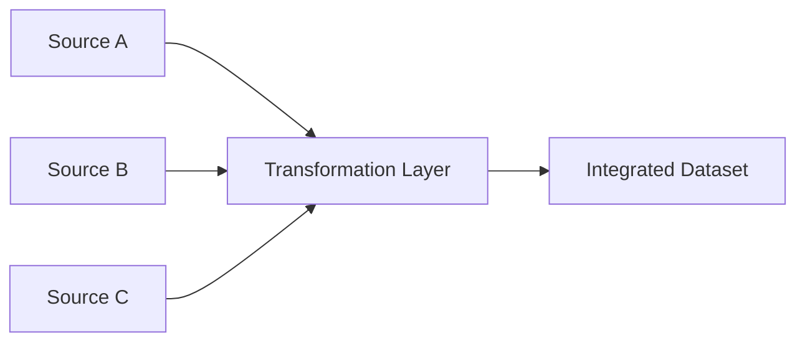

# Data Integration Challenges

Transformation also plays a critical role during data integration.

Data may originate from:

- Different sensors
    
- Multiple databases
    
- APIs
    
- External vendors
    

Blind merging creates:

- redundancy
    
- inconsistency
    
- conflicting formats
    

Transformation ensures integration occurs systematically.

