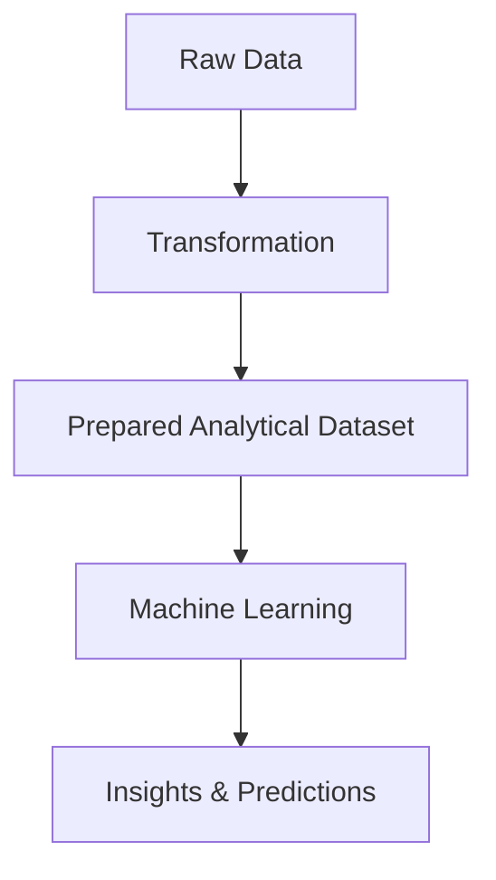

# Data Transformation as a Foundational Step

Transformation is described as a foundational stage for effective machine learning.

It ensures that:

- data becomes consistent
    
- models become computationally feasible
    
- analytical quality improves
    

The transformation layer therefore acts as preparation infrastructure for all downstream AI tasks.

