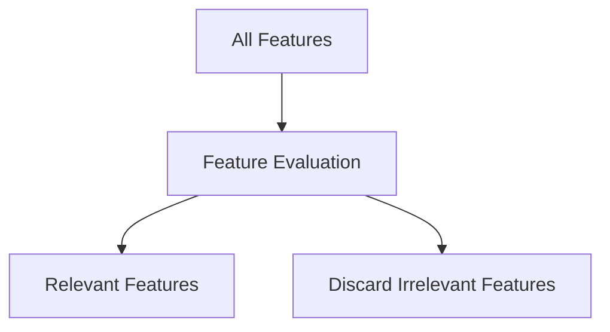

# Feature Selection and Attribute Subselection

The lecture introduces attribute subselection.

Not all collected variables contribute meaningfully to prediction.

Example:

|Feature|Importance|
|---|---|
|Humidity|Important|
|Temperature|Important|
|Random Feature ABC|Irrelevant|

Transformation identifies useful features and removes irrelevant ones.

This reduces both:

- computational burden
    
- noise inside the model
