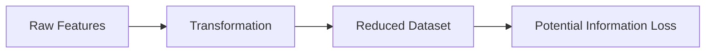

# Information Loss Problem

Removing features or rows may accidentally eliminate useful information.

Example:

```mermaid
flowchart LR
    A[Raw Features]
    --> B[Transformation]

    B --> C[Reduced Dataset]

    C --> D[Potential Information Loss]
```

Feature elimination therefore requires careful statistical and domain analysis.
