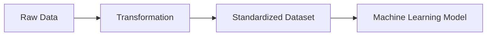

# Raw Data vs Transformed Data

The lecture highlights that raw collected values often operate on completely different scales.

Example:

|Feature|Example Scale|
|---|---|
|Humidity|0–100|
|Temperature|20–40|
|Wind Speed|Thousands|
|Wind Direction|Angular values|

Directly building machine learning models on such heterogeneous scales may produce unstable learning behavior.

Transformation therefore restructures the dataset into a more balanced and analyzable representation.

