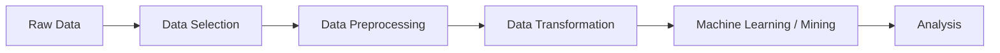

# Role of Data Transformation in the KDD Pipeline

The lecture connects transformation to the KDD pipeline.

The overall workflow becomes:

Transformation prepares the dataset for downstream learning algorithms.

It is therefore an intermediate but foundational stage.
