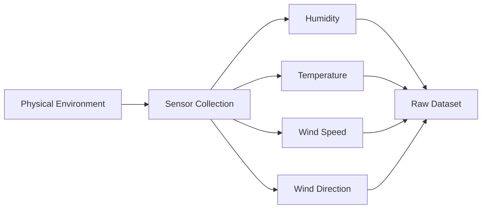

# Weather Prediction Example

The lecture repeatedly uses weather prediction to explain transformation intuitively.

Suppose the objective is:

> Predict whether it will rain tomorrow.

To answer this, multiple environmental variables must be collected.

|Parameter|Source|
|---|---|
|Humidity|Sensor|
|Temperature|Sensor|
|Wind Speed|Sensor|
|Wind Direction|Sensor|

The system gathers these physical measurements from the environment and stores them digitally.

