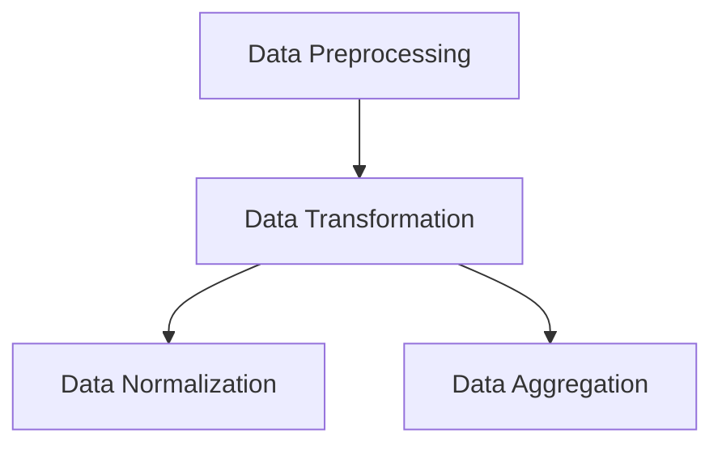
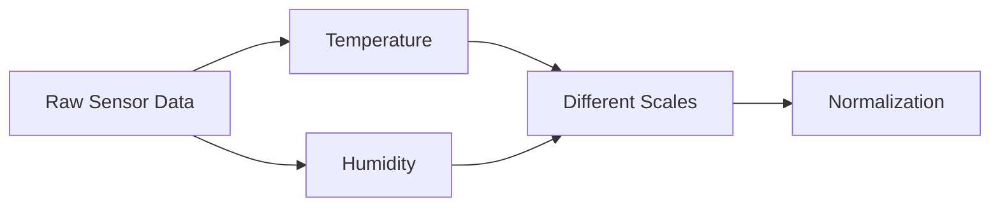
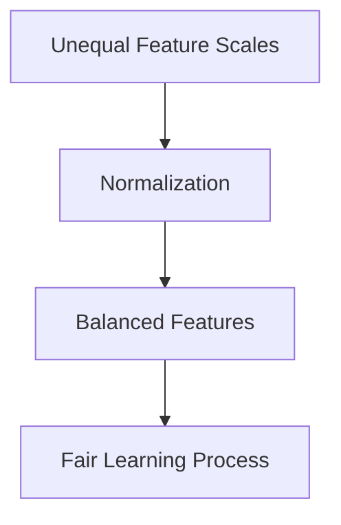
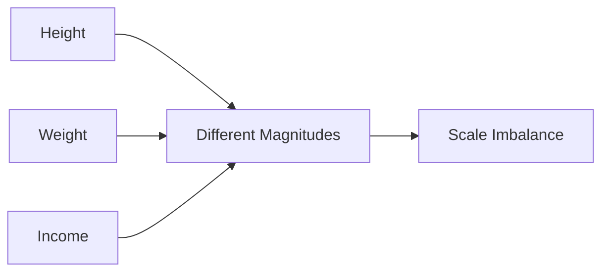
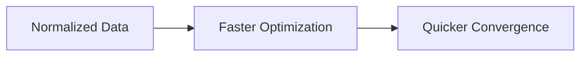
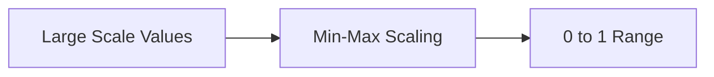

# Index

1. Introduction to Data Normalization
    
2. Position of Normalization in Data Transformation
    
3. Defining Data Normalization
    
4. Weather Prediction Example
    
5. Why Different Feature Scales are Dangerous
    
6. Purpose of Data Normalization
    
7. Equal Contribution of Features
    
8. Common Range Transformation
    
9. Distance-Based Learning and Scale Dominance
    
10. Height–Weight–Income Example
    
11. Euclidean Distance and Feature Bias
    
12. Discriminatory Features vs Large Magnitude Features
    
13. Benefits of Data Normalization
    
14. Faster Learning and Convergence
    
15. Improved Interpretability
    
16. Types of Normalization Techniques  
    16.1 Min-Max Normalization  
    16.2 Z-Score Normalization  
    16.3 Decimal Scaling
    
17. Min-Max Normalization Intuition
    
18. Z-Score Normalization Intuition
    
19. Decimal Scaling Intuition
    
20. Key Takeaways
    

# Introduction to Data Normalization

Data normalization is one of the most important stages in data transformation because machine learning algorithms are highly sensitive to differences in feature scale.

The lecture emphasizes that real-world datasets often contain attributes measured across vastly different magnitudes.

Example:

|Feature|Possible Scale|
|---|---|
|Height|1–2 meters|
|Weight|50–200 kg|
|Income|10,000–10,00,000|

If these raw values are used directly, high-magnitude features dominate mathematical computations.

Normalization prevents this imbalance.

# Position of Normalization in Data Transformation

The lecture places normalization inside the broader data transformation stage.

The hierarchy becomes:

Normalization is therefore one specific technique inside transformation workflows.

# Defining Data Normalization

The lecture defines normalization as a function that maps the values of an attribute into a new transformed range.

Conceptually:

$$  
x \rightarrow x'  
$$

where:

- $x$ = original value
    
- $x'$ = transformed normalized value
    

The important idea is:

> Every original value still corresponds to a transformed value.

Normalization changes representation, not meaning.

# Weather Prediction Example

The lecture again uses weather prediction to explain normalization.

Suppose the dataset contains:

|Temperature|Humidity|
|---|---|
|35|50|
|34|75|

The raw measurements originate from physical sensors.

However, different attributes naturally operate on different scales.

Normalization transforms all attributes into comparable ranges before machine learning begins.

# Why Different Feature Scales are Dangerous

The lecture strongly emphasizes that unequal feature scales distort machine learning behavior.

Example:

|Feature Type|Magnitude|
|---|---|
|Single Digit|1–9|
|Double Digit|10–99|
|Five Digit|10,000–100,000|

Suppose one feature ranges from:

$$  
0 \to 1  
$$

while another ranges from:

$$  
0 \to 1,000,000  
$$

The second attribute dominates most mathematical operations simply because its magnitude is larger.

# Purpose of Data Normalization

The lecture defines the main objective clearly:

> Ensure equal contribution of features.

Normalization prevents large-scale attributes from overpowering smaller-scale but potentially more informative features.

# Equal Contribution of Features

Normalization attempts to place all attributes into approximately similar numerical ranges.

Example:

|Before Normalization|
|---|
|Temperature: 0–100|
|Humidity: 0–500|

After normalization:

|After Normalization|
|---|
|Temperature: 0–1|
|Humidity: 0–1|

The transformed dataset now gives all features relatively equal influence during computation.

# Common Range Transformation

The lecture notes that normalization commonly maps features into ranges such as:

|Common Range|
|---|
|0–1|
|1–100|

or transforms them using:

- mean
    
- standard deviation
    

The exact strategy depends on:

- algorithm requirements
    
- domain knowledge
    
- feature characteristics
    

# Distance-Based Learning and Scale Dominance

Most machine learning algorithms rely heavily on distance computations.

Examples include:

|Algorithm Type|Dependency|
|---|---|
|KNN|Distance|
|K-Means|Distance|
|Clustering|Similarity|
|Recommendation Systems|Similarity|

The lecture explains that large-scale attributes dominate Euclidean distance calculations.

# Height–Weight–Income Example

The lecture uses a detailed example involving:

|Feature|Range|
|---|---|
|Height|1.5–1.8|
|Weight|90–300|
|Income|100–1,000,000|

The magnitudes differ dramatically.

Without normalization, income numerically dominates all calculations.

# Euclidean Distance and Feature Bias

The lecture demonstrates this problem using Euclidean distance.

Suppose:

|Data Point|Height|Income|
|---|---|---|
|D1|1|150|
|D2|2|1100|
|D3|1|100|

Distance between D3 and D1:

d(D3,D1)=\sqrt{(1-1)^2+(100-150)^2}

Distance between D3 and D2:

d(D3,D2)=\sqrt{(1-2)^2+(100-1100)^2}

Even though height is more discriminatory, income dominates because its magnitude is larger.

This creates biased similarity calculations.

# Discriminatory Features vs Large Magnitude Features

A major conceptual insight from the lecture is:

> Informative features are not always high-magnitude features.

In the example:

|Feature|True Discrimination|
|---|---|
|Height|High|
|Income|Lower|

However, income dominates distance calculations purely because:

$$  
Magnitude_{income} \gg Magnitude_{height}  
$$

Normalization corrects this imbalance.

# Benefits of Data Normalization

The lecture lists several advantages.

|Benefit|Explanation|
|---|---|
|Balanced Contribution|Fair feature influence|
|Faster Computation|Smaller numerical operations|
|Improved Learning|Better optimization|
|Better Similarity Analysis|More meaningful distances|
|Improved Stability|Reduced skew|

Normalization improves both mathematical fairness and computational efficiency.

# Faster Learning and Convergence

Machine learning optimization algorithms often converge faster on normalized data.

The lecture highlights:

- faster distance computation
    
- smoother optimization
    
- reduced numerical instability
    

Gradient-based methods especially benefit because feature scales become balanced.

# Improved Interpretability

Normalization also improves interpretability because all attributes become easier to compare numerically.

Example:

|Before|After|
|---|---|
|100–1,000,000|0–1|

Large-scale variation becomes compressed into a manageable analytical range.

# Types of Normalization Techniques

The lecture introduces three major normalization methods.

|Technique|Core Idea|
|---|---|
|Min-Max Normalization|Fixed range scaling|
|Z-Score Normalization|Mean-standard deviation scaling|
|Decimal Scaling|Decimal-place shifting|

## 16.1 Min-Max Normalization

Min-max normalization rescales values into a predefined range.

Usually:

$$  
0 \leq x' \leq 1  
$$

The transformed value becomes:

x' = \frac{x-min(x)}{max(x)-min(x)}

This preserves relative ordering while compressing magnitude.

## 16.2 Z-Score Normalization

Z-score normalization uses mean and standard deviation.

The transformed value represents distance from the mean.

genui{"math_block_widget_always_prefetch_v2":{"content":"z=\frac{x-\mu}{\sigma}"}}

where:

- $\mu$ = mean
    
- $\sigma$ = standard deviation
    

This method centers data around zero.

## 16.3 Decimal Scaling

Decimal scaling normalizes values by shifting decimal points.

Example:

|Original|Normalized|
|---|---|
|1000|1|
|2500|2.5|

The transformation becomes:

$$  
x' = \frac{x}{10^j}  
$$

where:

- $j$ controls decimal movement
    

# Min-Max Normalization Intuition

Min-max normalization compresses all observations into a fixed interval.

This is especially useful when algorithms expect bounded inputs.

# Z-Score Normalization Intuition

Z-score normalization standardizes values relative to the dataset distribution.

Positive Z-score:

$$  
z > 0  
$$

means above average.

Negative Z-score:

$$  
z < 0  
$$

means below average.

This method preserves distribution shape while normalizing scale.

# Decimal Scaling Intuition

Decimal scaling reduces magnitude using powers of 10.

Example:

|Raw Value|Shifted Value|
|---|---|
|5000|5|
|8500|8.5|

This is computationally simple but less statistically expressive than Z-score normalization.

# Key Takeaways

Data normalization is a transformation technique that rescales numerical attributes into comparable ranges.

The lecture emphasizes that normalization is necessary because machine learning algorithms are highly sensitive to feature magnitude differences.

Without normalization:

$$  
Large\ Magnitude\ Features \Rightarrow Dominant\ Computation  
$$

Three normalization methods are introduced:

|Method|
|---|
|Min-Max|
|Z-Score|
|Decimal Scaling|

The most important conceptual insight is that normalization ensures fairness between attributes so that informative features contribute based on meaning rather than numerical scale.