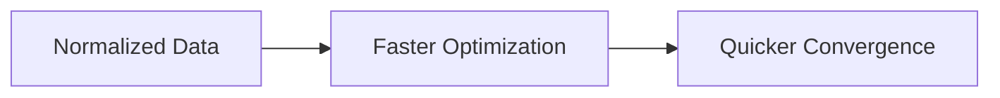

# Faster Learning and Convergence

Machine learning optimization algorithms often converge faster on normalized data.

The lecture highlights:

- faster distance computation
    
- smoother optimization
    
- reduced numerical instability
    

Gradient-based methods especially benefit because feature scales become balanced.

