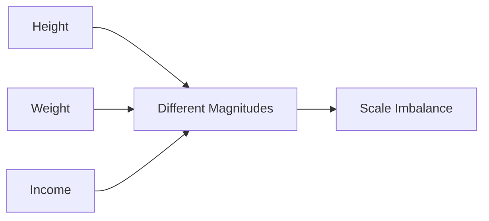

# Height–Weight–Income Example

The lecture uses a detailed example involving:

|Feature|Range|
|---|---|
|Height|1.5–1.8|
|Weight|90–300|
|Income|100–1,000,000|

The magnitudes differ dramatically.

Without normalization, income numerically dominates all calculations.
