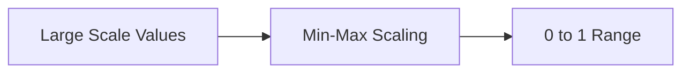

# Min-Max Normalization Intuition

Min-max normalization compresses all observations into a fixed interval.

```mermaid
flowchart LR
    A[Large Scale Values]
    --> B[Min-Max Scaling]

    B --> C[0 to 1 Range]
```

This is especially useful when algorithms expect bounded inputs.
