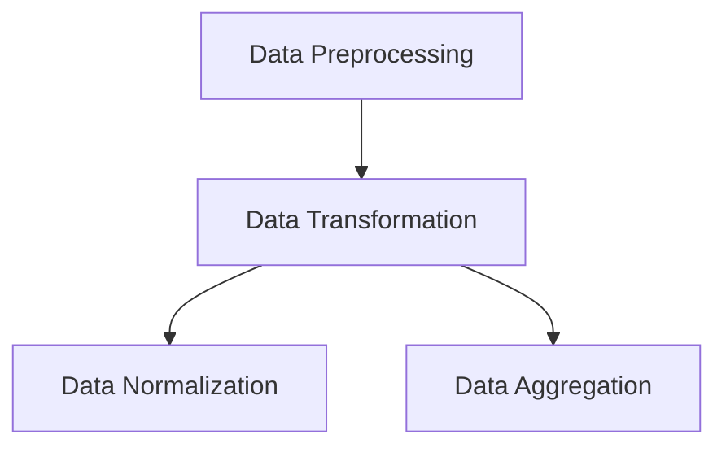

# Position of Normalization in Data Transformation

The lecture places normalization inside the broader data transformation stage.

The hierarchy becomes:

Normalization is therefore one specific technique inside transformation workflows.
