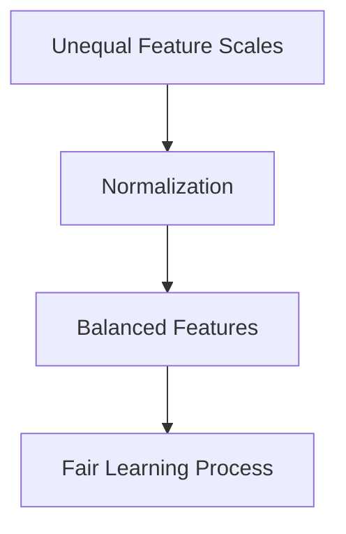

# Purpose of Data Normalization

The lecture defines the main objective clearly:

> Ensure equal contribution of features.

Normalization prevents large-scale attributes from overpowering smaller-scale but potentially more informative features.

