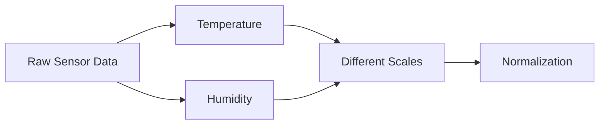

# Weather Prediction Example

The lecture again uses weather prediction to explain normalization.

Suppose the dataset contains:

|Temperature|Humidity|
|---|---|
|35|50|
|34|75|

The raw measurements originate from physical sensors.

However, different attributes naturally operate on different scales.

Normalization transforms all attributes into comparable ranges before machine learning begins.
