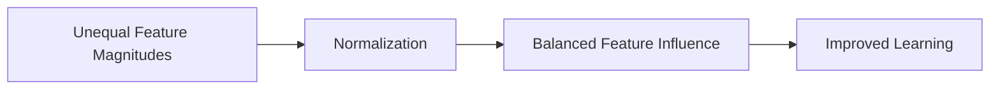
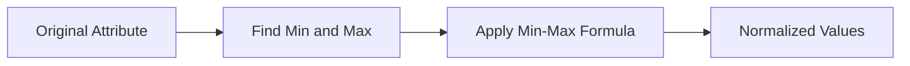
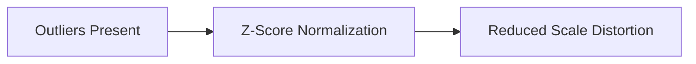

# Index

1. Introduction to Normalization Techniques
    
2. Why Normalization is Necessary
    
3. Min-Max Normalization  
    3.1 Core Idea  
    3.2 Formula  
    3.3 Step-by-Step Example  
    3.4 Linear Transformation Property  
    3.5 Advantages and Limitations
    
4. Z-Score Normalization  
    4.1 Core Idea  
    4.2 Formula  
    4.3 Mean and Standard Deviation  
    4.4 Step-by-Step Example  
    4.5 Robustness Against Outliers
    
5. Decimal Scaling Normalization  
    5.1 Core Idea  
    5.2 Formula  
    5.3 Step-by-Step Example  
    5.4 Relationship Preservation Discussion
    
6. Comparing the Three Methods
    
7. Impact of Outliers on Normalization
    
8. Choosing the Right Normalization Strategy
    
9. Linear vs Nonlinear Transformation
    
10. Key Takeaways
    

# Introduction to Normalization Techniques

The lecture focuses on three major normalization techniques used during data transformation:

|Technique|
|---|
|Min-Max Normalization|
|Z-Score Normalization|
|Decimal Scaling|

Normalization is required because machine learning algorithms are highly sensitive to feature magnitude differences.

If features operate on different scales, larger-valued attributes dominate mathematical computations such as:

- Euclidean distance
    
- Gradient optimization
    
- Similarity computation
    
- Clustering
    

Normalization ensures balanced contribution across attributes.

# Why Normalization is Necessary

Suppose one attribute ranges between:

$$  
1 \to 10  
$$

while another ranges between:

$$  
1000 \to 1,000,000  
$$

Even if the first attribute is more informative, the second attribute dominates calculations because of its larger numerical magnitude.

The lecture emphasizes:

> Magnitude influences machine learning behavior.

Normalization prevents this dominance.

# Min-Max Normalization

## 3.1 Core Idea

Min-max normalization transforms all values of an attribute into a predefined range.

Typically:

$$  
0 \leq x' \leq 1  
$$

The lecture explains that each original value is mapped into a new normalized value while preserving relative ordering.

## 3.2 Formula

The transformation formula is:

v' = \frac{v-min_A}{max_A-min_A}(new_max_A-new_min_A)+new_min_A

where:

|Symbol|Meaning|
|---|---|
|$v$|Original value|
|$v'$|Normalized value|
|$min_A$|Minimum attribute value|
|$max_A$|Maximum attribute value|
|$new_min_A$|New lower bound|
|$new_max_A$|New upper bound|

## 3.3 Step-by-Step Example

Suppose the attribute is:

|Age Values|
|---|
|30|
|40|
|50|
|80|
|15|

From the dataset:

|Quantity|Value|
|---|---|
|Minimum|15|
|Maximum|80|

Assume the new range is:

$$  
0 \to 1  
$$

Now normalize 30:

v' = \frac{30-15}{80-15}(1-0)+0

Result:

$$  
v' \approx 0.23  
$$

Similarly, every value in the attribute is transformed into the new range.

## 3.4 Linear Transformation Property

The lecture highlights a critical property:

> Min-max normalization performs linear transformation.

This means relative relationships between values remain preserved.

If:

$$  
a > b  
$$

before normalization, then:

$$  
a' > b'  
$$

after normalization as well.

Relative ordering and proportional structure remain intact.

## 3.5 Advantages and Limitations

### Advantages

|Benefit|Explanation|
|---|---|
|Simple|Easy computation|
|Bounded Output|Fixed range|
|Preserves Relationships|Linear mapping|

### Limitations

The lecture strongly emphasizes sensitivity to outliers.

Suppose an extreme outlier exists:

|Values|
|---|
|10|
|12|
|15|
|10000|

Now:

$$  
max_A = 10000  
$$

The outlier distorts the normalization scale.

This compresses most observations into a tiny region.

# Z-Score Normalization

## 4.1 Core Idea

Z-score normalization standardizes values relative to:

- mean
    
- standard deviation
    

Instead of using fixed ranges, it measures how far a point lies from the dataset average.

## 4.2 Formula

The transformation formula is:

z = \frac{v-\mu_A}{\sigma_A}

where:

|Symbol|Meaning|
|---|---|
|$v$|Original value|
|$\mu_A$|Mean of attribute|
|$\sigma_A$|Standard deviation|

## 4.3 Mean and Standard Deviation

The lecture explains the required statistical quantities.

Mean:

\mu = \frac{1}{n}\sum_{i=1}^{n}x_i

Standard deviation measures spread around the mean.

Z-score therefore represents:

$$  
\text{Distance from Average}  
$$

in units of standard deviation.

## 4.4 Step-by-Step Example

Suppose:

|Marks|
|---|
|35|
|65|
|90|

Mean becomes:

$$  
\mu \approx 63.33  
$$

Assume:

$$  
\sigma = 10  
$$

Now normalize 35:

z = \frac{35-63.33}{10}

Similarly:

|Original Value|Z-Score|
|---|---|
|65|0.5|
|90|3|

The transformed values now represent relative statistical positioning rather than raw magnitude.

## 4.5 Robustness Against Outliers

The lecture emphasizes a major advantage:

> Z-score normalization handles outliers better.

Why?

Because normalization depends on:

- mean
    
- standard deviation
    

rather than strict min/max boundaries.

Outliers still influence the statistics, but their effect is less catastrophic than in min-max normalization.

# Decimal Scaling Normalization

## 5.1 Core Idea

Decimal scaling normalizes values by shifting decimal points.

The process depends on:

- maximum absolute value
    
- number of digits
    

## 5.2 Formula

The transformation formula becomes:

v' = \frac{v}{10^j}

where:

|Symbol|Meaning|
|---|---|
|$v$|Original value|
|$j$|Number of digits in maximum absolute value|

## 5.3 Step-by-Step Example

Suppose:

|Attribute Values|
|---|
|915|
|-986|
|50|
|60|

Maximum absolute value:

$$  
986  
$$

Since 986 has:

$$  
3 \text{ digits}  
$$

we choose:

$$  
j=3  
$$

Now normalize:

915/10^3 = 0.915

and:

-986/10^3 = -0.986

All values are scaled downward by shifting decimal positions.

## 5.4 Relationship Preservation Discussion

The lecture notes an important distinction:

> Decimal scaling may not preserve linear relationships as clearly as min-max normalization.

This makes it mathematically simpler but sometimes less structurally informative.

# Comparing the Three Methods

|Property|Min-Max|Z-Score|Decimal Scaling|
|---|---|---|---|
|Uses Min/Max|Yes|No|No|
|Uses Mean/Std|No|Yes|No|
|Fixed Output Range|Yes|No|Approximate|
|Sensitive to Outliers|High|Lower|Moderate|
|Preserves Linear Relation|Yes|Mostly|Weaker|
|Computational Simplicity|High|Medium|Very High|

# Impact of Outliers on Normalization

The lecture strongly emphasizes outlier sensitivity.

## Min-Max Issue

If:

$$  
max_A \uparrow  
$$

because of a single outlier, then:

$$  
All\ Other\ Values \downarrow  
$$

after scaling.

This compresses the majority of observations.

## Z-Score Advantage

Z-score normalization distributes influence through:

- mean
    
- standard deviation
    

making it more stable under outlier-heavy datasets.

# Choosing the Right Normalization Strategy

The lecture suggests practical usage guidelines.

|Situation|Preferred Technique|
|---|---|
|Known bounded range|Min-Max|
|Presence of outliers|Z-Score|
|Fast lightweight scaling|Decimal Scaling|

Normalization strategy depends on:

- dataset distribution
    
- outlier presence
    
- algorithm assumptions
    
- computational constraints
    

# Linear vs Nonlinear Transformation

The lecture specifically mentions:

- Min-max normalization performs linear transformation
    
- Decimal scaling may not preserve relationships similarly
    

The lecture leaves an open conceptual question:

> Does Z-score normalization preserve linear relationships?

This becomes an important analytical exercise because Z-score also performs affine transformation based on statistical parameters.

# Key Takeaways

The lecture introduces three major normalization techniques:

|Technique|
|---|
|Min-Max|
|Z-Score|
|Decimal Scaling|

Normalization ensures balanced feature contribution during machine learning and similarity analysis.

The most important practical insight is:

$$  
Large\ Magnitude \neq More\ Important\ Feature  
$$

Without normalization, large-scale attributes dominate mathematical operations even if they are less informative.

Among the techniques:

- Min-max is simple but sensitive to outliers
    
- Z-score is statistically robust
    
- Decimal scaling is computationally lightweight
    

Normalization therefore becomes a foundational preprocessing step for reliable machine learning systems.