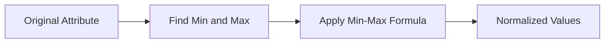

# 3.3 Step-by-Step Example

Suppose the attribute is:

|Age Values|
|---|
|30|
|40|
|50|
|80|
|15|

From the dataset:

|Quantity|Value|
|---|---|
|Minimum|15|
|Maximum|80|

Assume the new range is:

$$
0 \to 1
$$

Now normalize 30:

v' = \frac{30-15}{80-15}(1-0)+0

Result:

$$
v' \approx 0.23
$$

Similarly, every value in the attribute is transformed into the new range.

