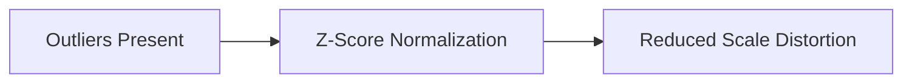

# 4.5 Robustness Against Outliers

The lecture emphasizes a major advantage:

> Z-score normalization handles outliers better.

Why?

Because normalization depends on:

- mean
    
- standard deviation
    

rather than strict min/max boundaries.

Outliers still influence the statistics, but their effect is less catastrophic than in min-max normalization.

