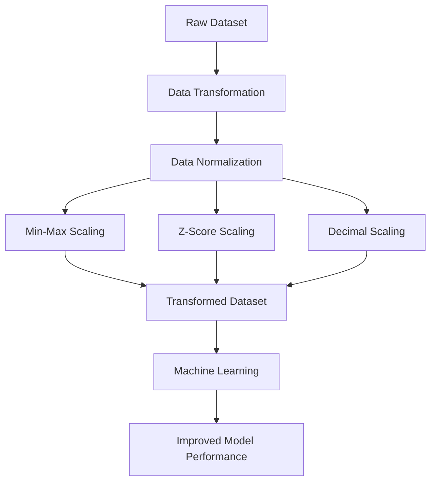

# Lesson 1: Data Transformation and Normalization

## Overview

Data transformation is a crucial stage in the data preprocessing pipeline. Raw data collected from various sources often exists in formats that are unsuitable for direct analysis or machine learning applications. Data transformation converts data into a structured, consistent, and analyzable format.

One of the most important transformation techniques is data normalization, which scales numerical attributes to a common range. Normalization helps eliminate the influence of differing measurement scales and ensures that features contribute equally during analytical and modeling processes.

This lesson introduces the concepts of data transformation and normalization, explores common normalization techniques, and demonstrates their practical implementation using Python.

Understanding these concepts is essential because many machine learning algorithms, statistical techniques, and distance-based methods are highly sensitive to differences in feature scales.

## Learning Objectives

After completing this lesson, you should be able to:

- Define data transformation and explain its importance.
- Understand why data normalization is required.
- Identify situations where normalization should be applied.
- Differentiate between various normalization techniques.
- Apply normalization methods using Python libraries.
- Evaluate the impact of normalization on data analysis and machine learning models.

## Topics Covered

### 1. [Introduction to Data Transformation](1.%20Introduction%20to%20Data%20Transformation.md)

Data transformation refers to the process of converting raw data into an appropriate format for analysis, reporting, and machine learning.

Common transformation activities include:

- Data normalization
- Standardization
- Encoding categorical variables
- Aggregation
- Smoothing
- Discretization
- Feature construction

The primary objectives of data transformation are:

- Improve data quality
- Increase analytical efficiency
- Enhance model performance
- Reduce inconsistencies
- Facilitate integration from multiple sources

Data transformation ensures that data is consistent, comparable, and suitable for downstream analytical tasks.

---

### 2. [Data Normalization](2.%20Data%20Normalization.md)

Data normalization is the process of scaling numerical attributes to a common range without distorting their underlying relationships.

Normalization becomes particularly important when attributes have significantly different scales.

Consider the following example:

| Attribute | Range |
|-----------|-------|
| Age | 18 to 65 |
| Annual Income | 20,000 to 2,000,000 |

Without normalization, algorithms may assign excessive importance to features with larger numerical values.

Normalization is widely used in:

- Machine Learning
- Data Mining
- Pattern Recognition
- Neural Networks
- Distance-based algorithms

Algorithms that commonly require normalization include:

- K-Means Clustering
- K-Nearest Neighbors (KNN)
- Support Vector Machines (SVM)
- Principal Component Analysis (PCA)
- Neural Networks

---

### 3. [Data Normalization Techniques](3.%20Data%20Normalization%20Techniques.md)

Several techniques can be used to normalize data depending on the analytical requirements.

#### Min-Max Normalization

Transforms data into a predefined range, typically `[0,1]`.

Formula:

$$
v' = \frac{v - min(A)}{max(A) - min(A)}
$$

Characteristics:

- Preserves original distribution shape.
- Sensitive to outliers.

---

#### Z-Score Normalization

Transforms values based on mean and standard deviation.

Formula:

$$
z = \frac{x - \mu}{\sigma}
$$

Characteristics:

- Produces data with mean `0` and standard deviation `1`.
- Less sensitive to varying ranges.
- Widely used in statistical analysis.

---

#### Decimal Scaling

Normalizes values by moving the decimal point.

Formula:

$$
v' = \frac{v}{10^j}
$$

where:

$$
j = \text{smallest integer such that } max(|v'|) < 1
$$

Characteristics:

- Simple to implement.
- Less commonly used in modern machine learning applications.

---

### Comparison of Normalization Techniques

| Technique | Output Range | Sensitive to Outliers | Common Usage |
|------------|-------------|----------------------|--------------|
| Min-Max | Fixed range (0 to 1) | Yes | Deep Learning, KNN |
| Z-Score | Mean = 0, Std = 1 | Moderate | Statistics, ML |
| Decimal Scaling | Less than 1 | Yes | Educational examples |

---

### 4. [Lab 5.1: Data Normalization Techniques](Lab%205.1_%20Data%20Normalization%20Techniques.ipynb)

This practical laboratory exercise demonstrates how normalization techniques can be implemented using Python.

Typical activities include:

- Exploring datasets with varying scales.
- Applying Min-Max normalization.
- Applying Z-Score normalization.
- Comparing normalized and non-normalized datasets.
- Visualizing the impact of normalization.
- Using Scikit-learn preprocessing utilities.

Example Python implementation:

```python
from sklearn.preprocessing import MinMaxScaler

scaler = MinMaxScaler()

normalized_data = scaler.fit_transform(df[['Salary']])
```

The lab provides hands-on experience in preparing datasets for machine learning applications.

## Conceptual Relationship



## Lesson Navigation

| Resource | Description |
|-----------|-------------|
| 📄 [Introduction to Data Transformation](1.%20Introduction%20to%20Data%20Transformation.md) | Introduction to data transformation concepts and objectives |
| 📄 [Data Normalization](2.%20Data%20Normalization.md) | Understand why normalization is necessary in data preprocessing |
| 📄 [Data Normalization Techniques](3.%20Data%20Normalization%20Techniques.md) | Explore various normalization methods and their applications |
| 📓 [Lab 5.1: Data Normalization Techniques](Lab%205.1_%20Data%20Normalization%20Techniques.ipynb) | Practical implementation of normalization techniques using Python |

## Key Takeaways

- Data transformation converts raw data into a suitable format for analysis.
- Normalization scales features to a common range.
- Feature scaling is essential for many machine learning algorithms.
- Min-Max, Z-Score, and Decimal Scaling are common normalization techniques.
- Proper normalization improves analytical accuracy and model performance.
- The choice of normalization technique depends on the data characteristics and analytical objectives.

## Prerequisites for Future Topics

The concepts introduced in this lesson provide the foundation for:

- Feature Engineering
- Machine Learning
- Clustering Algorithms
- Distance-Based Methods
- Principal Component Analysis (PCA)
- Neural Networks
- Data Mining
- Predictive Analytics
