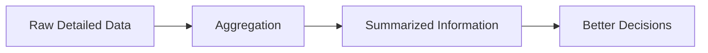
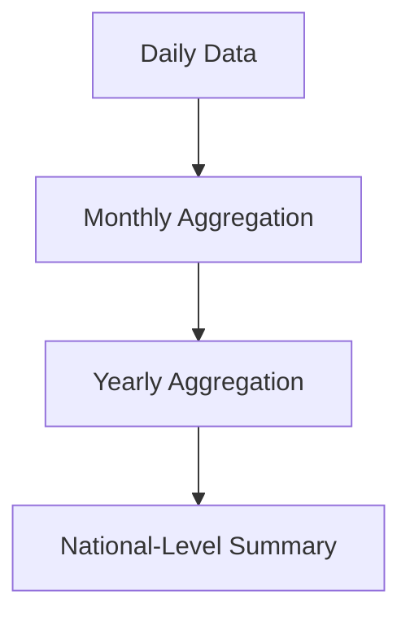
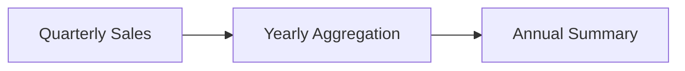
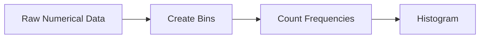
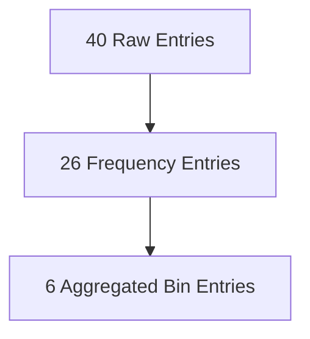
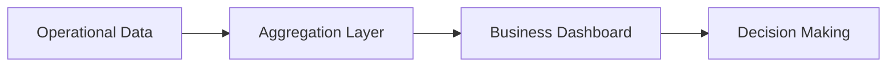

# Index

1. Introduction to Data Aggregation
    
2. Understanding Aggregation
    
3. Why Data Aggregation Matters
    
4. Data Aggregation as Data Reduction
    
5. Aggregation and Change of Scale
    
6. Aggregation for Stability and Smoothing
    
7. Benefits of Data Aggregation
    
8. Sales Aggregation Example
    
9. Rainfall Aggregation Example
    
10. Histograms as Aggregation Tools
    
11. Converting 1D Data into 2D Aggregated Data
    
12. Frequency-Based Aggregation
    
13. Data Reduction Through Histogram Binning
    
14. Lossy vs Lossless Transformation
    
15. Summarization Techniques
    
16. Aggregation in Business Intelligence
    
17. Key Takeaways
    

# Introduction to Data Aggregation

Data aggregation is one of the most important transformation techniques in data preprocessing because it helps simplify large datasets into concise and meaningful summaries.

The lecture frames aggregation as:

> Combining and consolidating raw data into summarized representations.

Instead of analyzing millions of detailed records individually, aggregation enables higher-level understanding by grouping observations together.

Aggregation is therefore deeply connected to:

- business intelligence
    
- analytics
    
- trend analysis
    
- reporting
    
- decision-making systems
    

# Understanding Aggregation

The lecture breaks the term into two parts:

|Term|Meaning|
|---|---|
|Data|Raw observations|
|Aggregation|Combine or summarize|

Data aggregation is therefore:

> The process of collecting and combining raw data from multiple sources into summarized and unified forms.

Formally:

$$  
Raw\ Data \rightarrow Summarized\ Data  
$$

Aggregation may involve:

- averaging
    
- grouping
    
- summing
    
- counting
    
- consolidation
    

# Why Data Aggregation Matters

Raw datasets are often:

- massive
    
- noisy
    
- highly detailed
    
- difficult to interpret
    

Aggregation reduces complexity and exposes higher-level patterns.

The lecture emphasizes that aggregation helps identify:

- trends
    
- patterns
    
- key metrics
    
- macro-level behavior
    

# Data Aggregation as Data Reduction

One major insight from the lecture is:

> Aggregation often performs data reduction.

Example:

|Original Data|Aggregated Form|
|---|---|
|Daily Rainfall|Yearly Rainfall|
|Monthly Sales|Annual Sales|

Suppose rainfall is recorded daily.

Without aggregation:

$$  
365 \text{ entries/year}  
$$

After yearly aggregation:

$$  
1 \text{ entry/year}  
$$

This dramatically reduces storage and computational complexity.

# Aggregation and Change of Scale

Aggregation also changes analytical scale.

Examples include:

|Fine Scale|Higher Scale|
|---|---|
|Region|State|
|State|Country|
|Daily Data|Monthly Data|
|Monthly Data|Yearly Data|

This allows analysts to switch between micro-level and macro-level perspectives.

# Aggregation for Stability and Smoothing

The lecture highlights an important statistical property:

> Aggregation reduces fluctuation.

Local observations may vary heavily over short intervals.

Example:

|Month|Rainfall|
|---|---|
|May|High fluctuation|

However, yearly averages become more stable.

Mathematically:

$$  
Variance_{aggregated} < Variance_{local}  
$$

Aggregation therefore acts as a smoothing mechanism.

# Benefits of Data Aggregation

The lecture identifies several major advantages.

|Benefit|Explanation|
|---|---|
|Simplifies Analysis|Easier interpretation|
|Improves Data Quality|Smoothing and cleaning|
|Reduces Storage|Fewer entries|
|Enhances Efficiency|Faster computation|
|Better Decision Making|Macro-level insights|

Aggregation therefore improves both analytical clarity and operational efficiency.

# Sales Aggregation Example

The lecture uses quarterly electronics sales data.

Suppose:

|Year|Quarter|Sales|
|---|---|---|
|2008|Q1|Value|
|2008|Q2|Value|
|2008|Q3|Value|
|2008|Q4|Value|

This structure repeats for multiple years.

Without aggregation:

$$  
12 \text{ entries}  
$$

If yearly aggregation is performed:

$$  
4 \text{ quarters} \rightarrow 1 \text{ yearly value}  
$$

The aggregated table makes trend comparison much easier.

# Rainfall Aggregation Example

The lecture also discusses Australian precipitation data.

Monthly rainfall distributions show large fluctuations.

However, when all monthly observations are aggregated into yearly averages:

- variance decreases
    
- stability increases
    
- overall rainfall trend becomes clearer
    

The lecture emphasizes that yearly aggregated rainfall gives a more meaningful national picture than isolated monthly snapshots.

# Histograms as Aggregation Tools

The lecture introduces histograms as a form of aggregation.

A histogram groups numerical values into bins and counts frequency.

Definition:

> A histogram summarizes numerical distributions using grouped ranges.

Histogram construction involves:

1. Dividing data into bins
    
2. Counting frequency per bin
    
3. Representing grouped structure
    

# Converting 1D Data into 2D Aggregated Data

The lecture uses item-price data.

Original data:

|Item Prices|
|---|
|1|
|1|
|5|
|5|
|5|
|8|
|10|

Initially this is one-dimensional data.

After aggregation:

|Price|Count|
|---|---|
|1|2|
|5|5|
|8|2|
|10|4|

The representation becomes two-dimensional:

- price
    
- frequency count
    

This reduces redundancy significantly.

# Frequency-Based Aggregation

Frequency counting itself is a major aggregation strategy.

Instead of storing repeated values individually:

$$  
[5,5,5,5,5]  
$$

store:

$$  
(5,5)  
$$

meaning:

|Value|Frequency|
|---|---|
|5|5|

This compresses repeated observations efficiently.

# Data Reduction Through Histogram Binning

The lecture demonstrates progressive aggregation.

## Step 1: Raw Data

Approximately:

$$  
40 \text{ entries}  
$$

## Step 2: Frequency Aggregation

Reduced to:

$$  
26 \text{ entries}  
$$

## Step 3: Bin Aggregation

Example bins:

|Range|Count|
|---|---|
|1–10|13|
|11–20|25|
|21–30|15|

Now only:

$$  
6 \text{ cells}  
$$

are required.

This illustrates the compression power of aggregation.

# Lossy vs Lossless Transformation

The lecture introduces two critical concepts.

|Type|Meaning|
|---|---|
|Lossless|Original data recoverable|
|Lossy|Original data unrecoverable|

## Lossless Transformation

If transformed data can reconstruct the original dataset exactly:

$$  
Recovered\ Data = Original\ Data  
$$

then the transformation is lossless.

## Lossy Transformation

If detailed information disappears permanently:

$$  
Recovered\ Data \neq Original\ Data  
$$

then the transformation is lossy.

Histogram binning often becomes lossy because exact original values are lost after grouping.

# Summarization Techniques

The lecture concludes with common summarization methods.

|Technique|Purpose|
|---|---|
|Summation|Total value|
|Averaging|Central tendency|
|Frequency Count|Occurrence count|
|Minimum/Maximum|Boundary extraction|

These methods reduce dimensionality while preserving important trends.

# Aggregation in Business Intelligence

Aggregation is foundational in business intelligence systems because executives rarely analyze raw operational data directly.

Examples:

|Raw Data|Business Metric|
|---|---|
|Individual Purchases|Monthly Revenue|
|Sensor Readings|Average Performance|
|Daily Website Visits|Weekly Traffic Trend|

Aggregation converts operational activity into strategic insights.

# Key Takeaways

Data aggregation combines detailed observations into summarized representations for easier analysis and decision making.

The lecture emphasizes that aggregation helps:

- reduce complexity
    
- improve interpretability
    
- stabilize fluctuations
    
- reduce storage
    
- improve computational efficiency
    

Aggregation techniques include:

|Technique|
|---|
|Summation|
|Averaging|
|Frequency Counting|
|Histogram Binning|

One of the most important conceptual insights is that aggregation often trades detail for simplicity.

This creates the distinction between:

- lossless transformation
    
- lossy transformation
    

Aggregation therefore becomes both a preprocessing and analytical abstraction tool within modern data science systems.