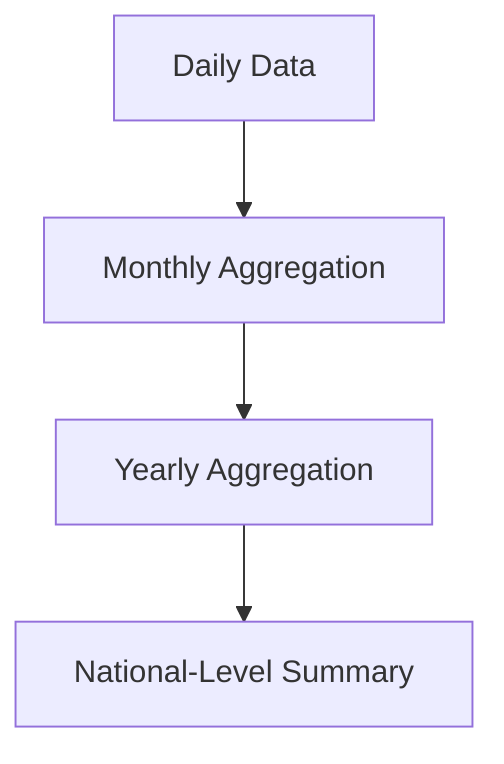

# Aggregation and Change of Scale

Aggregation also changes analytical scale.

Examples include:

|Fine Scale|Higher Scale|
|---|---|
|Region|State|
|State|Country|
|Daily Data|Monthly Data|
|Monthly Data|Yearly Data|

This allows analysts to switch between micro-level and macro-level perspectives.

