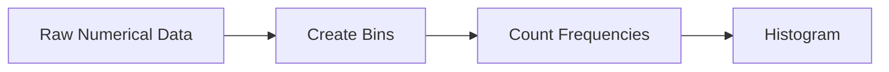

# Histograms as Aggregation Tools

The lecture introduces histograms as a form of aggregation.

A histogram groups numerical values into bins and counts frequency.

Definition:

> A histogram summarizes numerical distributions using grouped ranges.

Histogram construction involves:

1. Dividing data into bins
    
2. Counting frequency per bin
    
3. Representing grouped structure
    

