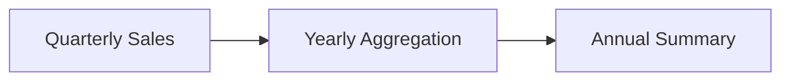

# Sales Aggregation Example

The lecture uses quarterly electronics sales data.

Suppose:

|Year|Quarter|Sales|
|---|---|---|
|2008|Q1|Value|
|2008|Q2|Value|
|2008|Q3|Value|
|2008|Q4|Value|

This structure repeats for multiple years.

Without aggregation:

$$
12 \text{ entries}
$$

If yearly aggregation is performed:

$$
4 \text{ quarters} \rightarrow 1 \text{ yearly value}
$$

The aggregated table makes trend comparison much easier.
