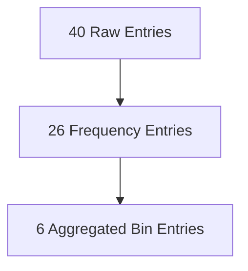

# Step 3: Bin Aggregation

Example bins:

|Range|Count|
|---|---|
|1–10|13|
|11–20|25|
|21–30|15|

Now only:

$$
6 \text{ cells}
$$

are required.

This illustrates the compression power of aggregation.
