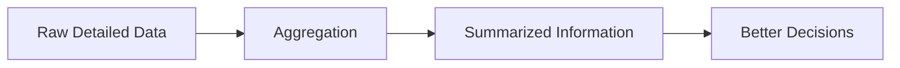

# Why Data Aggregation Matters

Raw datasets are often:

- massive
    
- noisy
    
- highly detailed
    
- difficult to interpret
    

Aggregation reduces complexity and exposes higher-level patterns.

The lecture emphasizes that aggregation helps identify:

- trends
    
- patterns
    
- key metrics
    
- macro-level behavior
    

