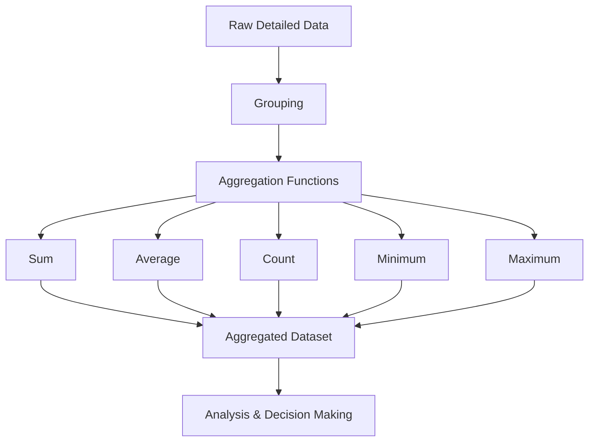

# Lesson 2: Data Aggregation

## Overview

Data aggregation is a fundamental data preprocessing technique that involves combining and summarizing detailed data into a higher-level representation. Rather than analyzing individual records, aggregated data provides summarized insights that help reveal patterns, trends, and relationships within datasets.

Aggregation is widely used in Data Science, Business Intelligence, Data Warehousing, and Machine Learning to reduce data complexity, improve computational efficiency, and support decision-making.

This lesson introduces the concept of data aggregation, explores common aggregation techniques, and demonstrates how aggregation can be performed using practical Python implementations.

Understanding data aggregation is essential because many real-world analytical tasks involve transforming granular data into meaningful summaries.

## Learning Objectives

After completing this lesson, you should be able to:

- Define data aggregation and explain its importance.
- Understand how aggregation reduces data complexity.
- Apply common aggregation operations to datasets.
- Explain the advantages and limitations of aggregated data.
- Perform data aggregation using Python libraries such as Pandas.
- Interpret aggregated results for analytical purposes.

## Topics Covered

### 1. [Data Aggregation](4.%20Data%20Aggregation.md)

Data aggregation is the process of combining multiple data records to produce summary information.

Common aggregation operations include:

- Sum
- Average (Mean)
- Count
- Minimum
- Maximum
- Median
- Standard Deviation

Aggregation can be performed across different dimensions such as:

- Time
- Geography
- Product categories
- Customer segments

Examples include:

| Raw Data | Aggregated Data |
|-----------|----------------|
| Daily sales transactions | Monthly sales totals |
| Individual customer purchases | Total purchases per customer |
| Hourly website visits | Daily website traffic |

Aggregation helps analysts focus on broader patterns rather than individual observations.

---

### Common Applications of Data Aggregation

#### Business Analytics

- Monthly revenue reports
- Sales performance summaries
- Customer segmentation

#### Data Warehousing

- OLAP cube generation
- Summary tables
- Fact table rollups

#### Machine Learning

- Feature engineering
- Time-series summarization
- Customer behavior profiling

#### Statistical Analysis

- Group-wise analysis
- Comparative studies
- Trend analysis

---

### Advantages of Data Aggregation

- Reduces dataset size.
- Improves computational efficiency.
- Simplifies data interpretation.
- Reveals hidden patterns and trends.
- Supports strategic decision-making.

---

### Limitations of Data Aggregation

- May result in information loss.
- Can hide individual-level variations.
- Excessive aggregation may obscure anomalies.
- Aggregated results may introduce bias if performed incorrectly.

Careful selection of aggregation levels is therefore essential.

---

### 2. [Lab 5.2: Data Aggregation Techniques](Lab%205.2_%20Data%20Aggregation%20Techniques.ipynb)

This practical laboratory exercise demonstrates various data aggregation techniques using Python.

Typical activities include:

- Grouping data using `groupby()`
- Computing summary statistics
- Aggregating across multiple dimensions
- Creating pivot tables
- Performing hierarchical aggregations
- Visualizing aggregated results

The lab bridges theoretical understanding with practical implementation.

Example Python operations may include:

```python
# Average salary by department
df.groupby('Department')['Salary'].mean()

# Total sales by region
df.groupby('Region')['Sales'].sum()

# Multiple aggregations
df.groupby('Category').agg({
    'Sales': ['sum', 'mean'],
    'Profit': ['mean', 'max']
})
```

## Conceptual Relationship



## Lesson Navigation

| Resource | Description |
|-----------|-------------|
| 📄 [Data Aggregation](4.%20Data%20Aggregation.md) | Introduction to aggregation concepts, techniques, and applications |
| 📓 [Lab 5.2: Data Aggregation Techniques](Lab%205.2_%20Data%20Aggregation%20Techniques.ipynb) | Hands-on implementation of aggregation techniques using Python |

## Real-World Examples

| Domain | Example |
|---------|---------|
| Retail | Total monthly sales by store |
| Healthcare | Average patient stay duration by hospital |
| Finance | Quarterly revenue by business unit |
| Web Analytics | Daily website visits |
| Education | Average student scores by course |

## Key Takeaways

- Data aggregation summarizes detailed data into higher-level information.
- Aggregation reduces complexity and improves analytical efficiency.
- Common aggregation functions include sum, mean, count, minimum, and maximum.
- Aggregation is extensively used in Business Intelligence, Data Warehousing, and Machine Learning.
- Excessive aggregation can result in information loss.
- Appropriate aggregation levels are critical for meaningful analysis.

## Prerequisites for Future Topics

The concepts introduced in this lesson provide the foundation for:

- Data Transformation
- Feature Engineering
- Exploratory Data Analysis (EDA)
- OLAP and Data Warehousing
- Machine Learning
- Time Series Analysis
- Business Intelligence Reporting
