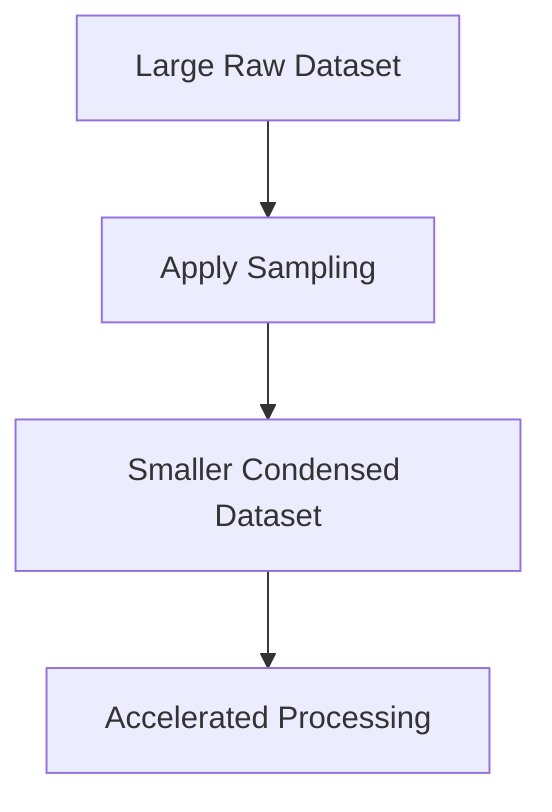
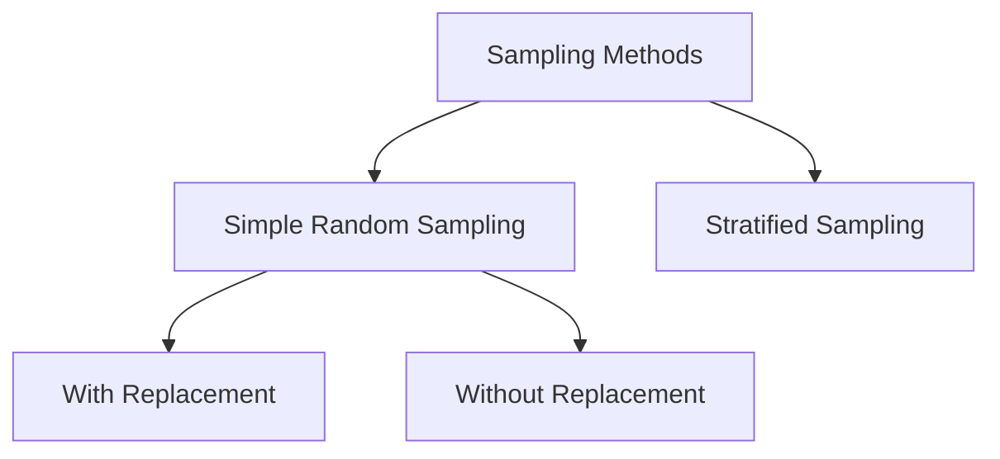
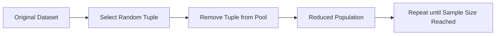
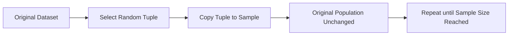
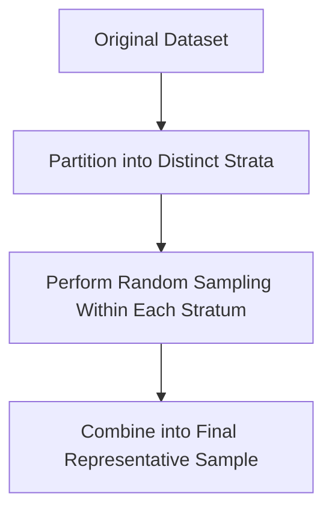
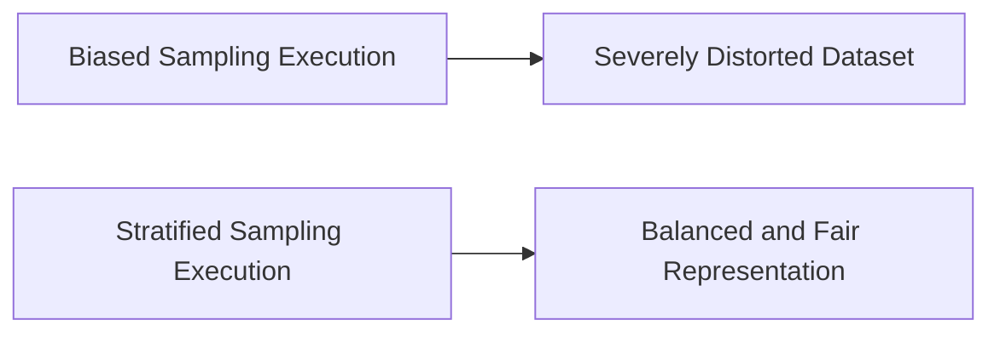
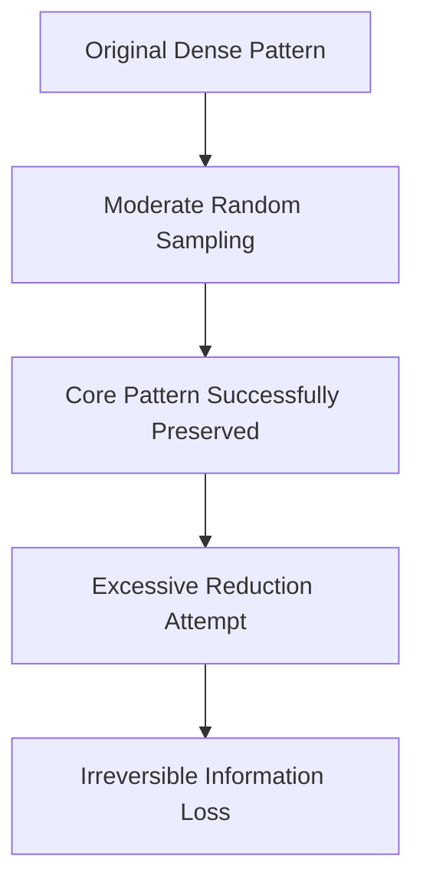

# 7.1. Data Sampling

## 7.1.1. Introduction to Data Sampling

Data sampling is a primary data reduction technique used to decrease dataset volume while rigorously preserving the essential statistical properties of the original data.

Instead of processing a massive, full-scale dataset, machine learning systems may process only a carefully chosen subset.

>[!Tip]
> Sampling is the process of selecting a smaller subset of data that approximately represents the overall behavior of the original dataset.

This strategic reduction improves several critical system metrics:
- computational cost
- storage requirements
- processing time

Crucially, this data reduction is performed while maintaining useful and reliable analytical behavior for downstream predictive models.

## 7.1.2. Why Sampling is Necessary

Modern real-world datasets are often overwhelmingly large. 

Processing the entire dataset natively without reduction may quickly become:
- computationally expensive
- memory intensive
- temporally prohibitive

Statisticians and data scientists therefore use samples to approximate the behavior of the original dataset.

The core mathematical mapping is:

$$
\text{Original Dataset} \rightarrow \text{Representative Sample}
$$

If the chosen sample successfully preserves the original statistical structure, machine learning models trained on the sample will behave almost identically to models trained on the complete data. We rely heavily on this fundamental mapping:

$$
\text{Original Dataset} \rightarrow \text{Representative Sample}
$$

## 7.1.3. Representative Samples

A sample provides zero analytical value unless it is genuinely representative.

>[!Note]
> A representative sample is a subset that strictly preserves the mathematical and structural properties of the original dataset.

The underlying properties that must be preserved include:
- probability distributions
- underlying macro trends
- statistical summaries
- important outlier patterns

If the sampling methodology destroys the original structure, the resulting sample becomes analytically unreliable and actively harms downstream predictive models.

## 7.1.4. Sampling in Data Reduction

Sampling serves as a foundational volume reduction technique, operating alongside other methods like histogram binning and data aggregation.

The following table illustrates the dramatic scale reduction typical in sampling processes.

| Dataset Type | Expected Row Size | Processing Speed Impact |
|----------|----------|----------|
| Original Dataset | 10,000 rows | Severe System Bottleneck |
| Sampled Dataset | 1,000 rows | Rapid Execution Time |

The sampled dataset becomes significantly cheaper and faster to process.

The ultimate goal of this pipeline is actively reducing file size while meticulously preserving statistical information quality.

## 7.1.5. Practical Considerations in Sampling

Executing a successful sampling strategy requires balancing multiple practical concerns before writing any algorithmic logic.

The following table outlines the key considerations and their system impacts if ignored.

| Consideration | Practical Importance | Risk if Ignored |
|----------|----------|----------|
| Sample Size | Must be sufficiently large | High statistical variance |
| Representation | Must preserve distribution | Invalid mathematical conclusions |
| Bias Avoidance | Prevent unfair selection | Skewed predictive models |
| Pattern Preservation | Retain trends and outliers | Complete loss of complex signals |

### 5.1 The Small Sample Problem

Very small samples carry extreme statistical risk because they may:
- miss important global trends
- completely remove rare, critical events
- severely distort underlying distributions

### 5.2 The Large Sample Problem

Conversely, very large samples negate the computational benefit of sampling itself.

Therefore, data engineers must optimize the following core tradeoff:

$$
\text{Sample Size} \implies \text{Tradeoff Between Accuracy and Efficiency}
$$

## 7.1.6. Types of Sampling Methods

The mathematical approach to selecting tuples divides sampling into two broad algorithmic categories.

The following table categorizes the primary methods used in active statistical practice.

| Sampling Category | Specific Subtype | Core Focus |
|----------|----------|----------|
| Simple Random Sampling | With Replacement | Absolute Independence |
| Simple Random Sampling | Without Replacement | Absolute Diversity |
| Stratified Sampling | Proportionate Allocation | Subgroup Representation |

Each method applies different strict constraints to how the specific subset is populated.

## 7.1.7. Simple Random Sampling

Simple random sampling is the most fundamental technique, assigning an absolutely identical probability of selection to every tuple in the dataset.

Formally, the probability of selecting any individual tuple is:

$$
P(\text{Tuple}_i) = \frac{1}{N}
$$

where:
- $$P(\text{Tuple}_i)$$ = probability of selecting the $$i$$-th tuple
- $$N$$ = total number of tuples in the population

Under this framework, every single tuple has a strictly equal chance of algorithmic selection.

From this pure mathematical foundation, the procedure separates into two distinct mechanical processes: sampling without replacement and sampling with replacement.

## 7.1.8. Simple Random Sampling Without Replacement (SRSWOR)

### 8.1 Core Idea

In simple random sampling without replacement, the available population actively shrinks as items are iteratively chosen.

>[!Note]
> Once a tuple is selected, it is permanently removed from the overall population.

This strict removal guarantees that the exact same tuple cannot possibly appear twice in the final sample.

### 8.2 Probability Changes Across Iterations

Because tuples are removed, the total population size decreases, causing the selection probability for the remaining items to increase dynamically.

Suppose there is an initial population where:

$$
N = 8
$$

At the absolute beginning, the probability of selection is:

$$
P(\text{selection}) = \frac{1}{8}
$$

After successfully selecting one tuple, the remaining population becomes 7, making the new baseline probability:

$$
P(\text{selection}) = \frac{1}{7}
$$

After selecting a second tuple, the probability changes once again:

$$
P(\text{selection}) = \frac{1}{6}
$$

This mathematical shift continues iteratively. The probability changes continuously because the available population size strictly decreases after every independent selection.

### 8.3 Step-by-Step Example of SRSWOR

To demonstrate how probabilities shift dynamically, we will step through a manual extraction.

Suppose:
- Original dataset tuples = A, B, C, D, E
- Initial population size = 5
- Required sample size = 3

### Step 1: Calculate Initial Probability
$$ P(\text{selection}) = \frac{1}{5} = 0.20 $$

### Step 2: Perform First Selection
Tuple C is randomly selected

### Step 3: Adjust Population Size
Tuple C is permanently removed, making the new population size 4

### Step 4: Perform Second Selection
$$ P(\text{selection}) = \frac{1}{4} = 0.25 $$

### Step 5: Perform Final Selection
$$ P(\text{selection}) = \frac{1}{3} \approx 0.33 $$

### 8.4 Characteristics of SRSWOR

The mechanical removal of items fundamentally defines the statistical properties of this specific method.

The following table summarizes the deterministic traits of simple random sampling without replacement.

| Property | Expected Behavior | Mathematical Reason |
|----------|----------|----------|
| Duplicate Tuples | Strictly Impossible | Items are removed forever |
| Population Size | Strictly Decreases | Evaluates as N - 1 continuously |
| Selection Probability | Dynamically Changes | The dividing denominator shrinks |

This method naturally produces a highly distinct and fully diverse set of sampled tuples.

## 7.1.9. Simple Random Sampling With Replacement (SRSWR)

### 9.1 Core Idea

Sampling with replacement takes the exact opposite mechanical approach to population management.

>[!Note]
> Selected tuples are copied into the sample but are NOT removed from the original dataset.

Because the tuple is conceptually placed back into the pool, the exact same tuple may easily appear multiple times in the final resulting sample.

### 9.2 Constant Probability Property

Since tuples are never permanently removed, the population size remains completely static across time.

Consequently, the baseline probability formula:

$$
P(\text{selection}) = \frac{1}{N}
$$

remains absolutely constant across all iterations. We repeat this fundamental rule because it defines the entire method:

$$
P(\text{selection}) = \frac{1}{N}
$$

If the initial population size is:

$$
N = 8
$$

Then the probability during the first iteration is strictly:

$$
P(\text{selection}) = \frac{1}{8}
$$

And during the one-thousandth iteration, it firmly continues using:

$$
P(\text{selection}) = \frac{1}{8}
$$

### 9.3 Step-by-Step Example of SRSWR

To demonstrate the distinct possibility of duplication, we will step through a replacement sequence.

Suppose:
- Original dataset tuples = A, B, C, D, E
- Initial population size = 5
- Required sample size = 3

### Step 1: Calculate Initial Probability
$$ P(\text{selection}) = \frac{1}{5} = 0.20 $$

### Step 2: Perform First Selection
Tuple B is randomly selected and copied

### Step 3: Replace First Selection
Tuple B is returned to the pool, making the population size remain 5

### Step 4: Perform Second Selection
$$ P(\text{selection}) = \frac{1}{5} = 0.20 $$

### Step 5: Perform Final Selection
Tuple B is randomly selected again resulting in Final Sample {B, D, B}

### 9.4 Characteristics of SRSWR

The lack of tuple removal fundamentally alters the mathematical properties of the resulting subset.

The following table summarizes the deterministic behavior of simple random sampling with replacement.

| Property | Expected Behavior | Mathematical Reason |
|----------|----------|----------|
| Duplicate Tuples | Entirely Possible | Items are functionally replaced |
| Population Size | Strictly Constant | Original N remains N |
| Selection Probability | Strictly Constant | The denominator is totally fixed |

This method behaves identically to repeated, entirely independent probabilistic coin flips.

## 7.1.10. Comparing With vs Without Replacement

The strict operational distinction between the two simple random sampling techniques is crucial for proper experimental design.

The following table explicitly contrasts the mechanical and mathematical differences.

| System Property | Without Replacement (SRSWOR) | With Replacement (SRSWR) |
|----------|----------|----------|
| Tuple Removal Action | Yes | No |
| Duplicate Samples Found | Impossible | Possible |
| Selection Probability State | Dynamically Changes | Remains Constant |

This exact operational divide heavily influences downstream variance calculations and bootstrapping behaviors in advanced machine learning.

## 7.1.11. Stratified Sampling

### 11.1 Core Idea

Simple random sampling, while mathematically unbiased, is completely blind to underlying group structures. Stratified sampling proactively preserves specific subgroup distributions during the overall reduction process.

Instead of blindly selecting tuples entirely at random, the complete dataset is deliberately partitioned into non-overlapping subgroups called strata.

### 11.2 Maintaining Distribution

The primary mathematical imperative of stratified sampling is maintaining exact internal group ratios.

>[!Tip]
> The proportional distribution of subgroups must remain approximately identical between the original dataset and the newly created final sample.

Suppose an original dataset of human subjects contains the following demographic breakdown.

| Demographic Category | Original Dataset Count | True Population Proportion |
|----------|----------|----------|
| Youth | 400 | 28.5% |
| Middle Age | 800 | 57.1% |
| Senior | 200 | 14.4% |

If a data scientist arbitrarily executes pure random sampling, they might accidentally select zero seniors due to raw probability. Stratified sampling algorithmically prevents this exact scenario by mathematically enforcing the proportions in the final subset.

### 11.3 Strata Formation

To accomplish this structurally, each mutually exclusive subgroup becomes a separate, heavily isolated stratum.

Sampling is then deliberately performed independently inside each localized group. This rigorous compartmentalization fully prevents severe subgroup imbalance and permanently guarantees strict minority representation.

### 11.4 Step-by-Step Example of Stratified Sampling

To demonstrate proportional mathematical allocation, we calculate exact sample targets.

Suppose:
- Total original dataset size = 1400
- Desired final sample size = 140
- Subgroup Youth = 400
- Subgroup Middle Age = 800
- Subgroup Senior = 200

### Step 1: Calculate Sampling Fraction
$$ \text{Fraction} = \frac{140}{1400} = 0.10 $$

### Step 2: Define Strata
The dataset is split into exactly three completely independent groups

### Step 3: Allocate Youth Sample
$$ 400 \times 0.10 = 40 $$

### Step 4: Allocate Middle Age Sample
$$ 800 \times 0.10 = 80 $$

### Step 5: Allocate Senior Sample
$$ 200 \times 0.10 = 20 $$

The exact proportional structure of the dataset remains rigorously preserved inside the final combined sample.

## 7.1.12. Sampling Bias and Fair Representation

Naive, purely random sampling natively generates severe statistical bias when initial datasets are highly imbalanced.

If an algorithm utilizes purely random selection on heavily skewed data:
- critical minority categories may disappear entirely
- existing skewed distributions may become mathematically extreme
- overall model fairness and equity degrade significantly

The following table explicitly shows how stratification mitigates these exact biases.

| Sampling Approach | Handling of Minorities | Final Model Equity Outcome |
|----------|----------|----------|
| Pure Random | High risk of arbitrary exclusion | Potentially Highly Biased |
| Stratified Random | Mathematical guaranteed inclusion | Proportionally Fair Representation |

## 7.1.13. Sampling and Pattern Preservation

Preserving explicit internal geometric or statistical patterns is an incredibly important aspect of data reduction.

Suppose the original complete dataset contains exactly:

$$
N = 8000
$$

data points forming a highly visible geometric clustering structure on a scatter plot.

After applying a moderate sampling reduction, a dataset of:

$$
n = 2000
$$

points will highly likely still preserve the exact visual and mathematical boundaries of the clusters.

However, if the data engineer applies an excessive, overly aggressive reduction directly down to:

$$
n = 50
$$

points, the sampling procedure will destroy the visible cluster structure entirely, permanently rendering the data mathematically useless.

## 7.1.14. Risks of Over-Reduction

The boundary between highly efficient sampling and total data destruction is dangerously thin.

>[!Warning]
> Excessive compression structurally destroys valid and required statistical information.

If a chosen sampling fraction becomes fundamentally too aggressive:
- true underlying distributions morph and change shapes
- highly important rare baseline events completely disappear
- valid correlational patterns vanish entirely into background noise
- overall downstream inference quality decreases sharply

The fundamental mathematical rule that must be respected is:

$$
\text{Too Much Reduction} \implies \text{Permanent Information Loss}
$$

To prevent catastrophic system failure, we always evaluate:

$$
\text{Too Much Reduction} \implies \text{Permanent Information Loss}
$$

## 7.1.15. Computational Benefits of Sampling

When calibrated mathematically correctly, sampling dramatically and safely improves overall computational efficiency.

The following table lists the direct hardware and system benefits gained by utilizing sampling prior to algorithmic training.

| System Benefit | Technical Explanation | Direct Downstream Result |
|----------|----------|----------|
| Faster Processing Time | Algorithm loops over far fewer items | Rapid Model Convergence |
| Lower Memory Consumption | Matrices require fewer physical gigabytes | Prevents Out-of-Memory Errors |
| Quicker Experimentation | Allows highly rapid hypothesis testing | Faster Developer Iteration |

Sampling is fundamentally a required and inescapable process during preliminary exploratory data analysis.

## 7.1.16. Sampling in Data Mining and Machine Learning

In modern enterprise deployment environments, mathematical sampling is essentially mandatory. It becomes extremely important across multiple complex technical domains:
- distributed cluster computing architectures
- massive big data processing pipelines
- real-time continuous streaming analytics
- preliminary scalable machine learning prototyping

Massive distributed cloud systems often physically cannot process petabyte-scale datasets repeatedly during the hyperparameter tuning phase. Careful, strictly representative sampling becomes the sole viable practical solution.

## 7.1.17. Key Takeaways

Data sampling is a paramount data reduction technique actively used to drastically decrease computational complexity while strictly preserving the important statistical properties of the original dataset.

The three fundamentally distinct sampling methods mathematically discussed are:

| Sampling Method | Operational Definition | Primary Use Case Scenario |
|----------|----------|----------|
| Random Without Replacement | Tuples removed exactly after selection | General variance reduction |
| Random With Replacement | Tuples continually remain available | Algorithmic Bootstrapping |
| Stratified Sampling | Subgroups are proportionally sampled | Highly imbalanced populations |

The single most important conceptual insight defining this entire field is the ultimate approximation goal:

$$
\text{Good Samples} \approx \text{Original Dataset Behavior}
$$

A sampled subset safely holds robust scientific value only if it rigorously preserves:
- original probability distributions
- underlying long-term macro trends
- highly specific micro correlational patterns
- overall global statistical behavior

Stratified sampling acts as a crucial enhancement to pure randomness, proactively improving downstream algorithmic fairness by artificially forcing exact subgroup distributions during the volume reduction process.
