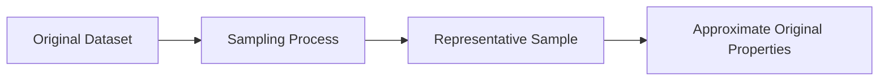

# 7.1.3. Representative Samples

A sample provides zero analytical value unless it is genuinely representative.

>[!Note]
> A representative sample is a subset that strictly preserves the mathematical and structural properties of the original dataset.

The underlying properties that must be preserved include:
- probability distributions
- underlying macro trends
- statistical summaries
- important outlier patterns

If the sampling methodology destroys the original structure, the resulting sample becomes analytically unreliable and actively harms downstream predictive models.
