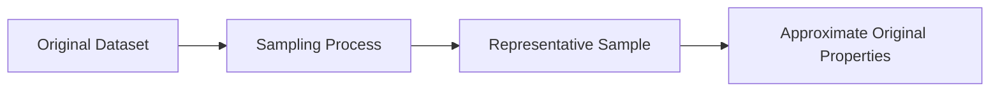

# 7.1.3. Representative Samples

A sample provides zero analytical value unless it is genuinely representative.

>[!Note]
> A representative sample is a subset that strictly preserves the mathematical and structural properties of the original dataset.

The underlying properties that must be preserved include:
- probability distributions
- underlying macro trends
- statistical summaries
- important outlier patterns

If the sampling methodology destroys the original structure, the resulting sample becomes analytically unreliable and actively harms downstream predictive models.

<!-- NAVIGATION FOOTER START -->
 

---

[ **Previous File:** 7.1.02. Why Sampling is Necessary](./7.1.02.%20Why%20Sampling%20is%20Necessary.md) &nbsp;&nbsp;&nbsp;&nbsp;&nbsp;&nbsp; [ **Next File:** 7.1.04. Sampling in Data Reduction](./7.1.04.%20Sampling%20in%20Data%20Reduction.md)

<!-- NAVIGATION FOOTER END -->