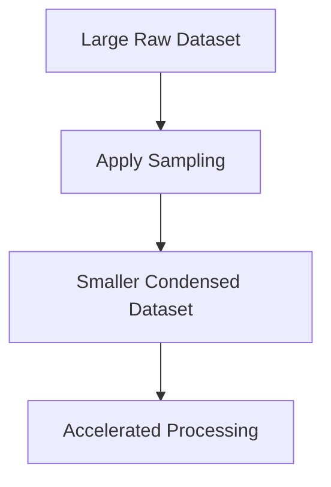

# 7.1.4. Sampling in Data Reduction

Sampling serves as a foundational volume reduction technique, operating alongside other methods like histogram binning and data aggregation.

The following table illustrates the dramatic scale reduction typical in sampling processes.

| Dataset Type | Expected Row Size | Processing Speed Impact |
|----------|----------|----------|
| Original Dataset | 10,000 rows | Severe System Bottleneck |
| Sampled Dataset | 1,000 rows | Rapid Execution Time |

The sampled dataset becomes significantly cheaper and faster to process.

The ultimate goal of this pipeline is actively reducing file size while meticulously preserving statistical information quality.

<!-- NAVIGATION FOOTER START -->
 

---

[ **Previous File:** 7.1.03. Representative Samples](./7.1.03.%20Representative%20Samples.md) &nbsp;&nbsp;&nbsp;&nbsp;&nbsp;&nbsp; [ **Next File:** 7.1.05. Practical Considerations in Sampling](./7.1.05.%20Practical%20Considerations%20in%20Sampling.md)

<!-- NAVIGATION FOOTER END -->