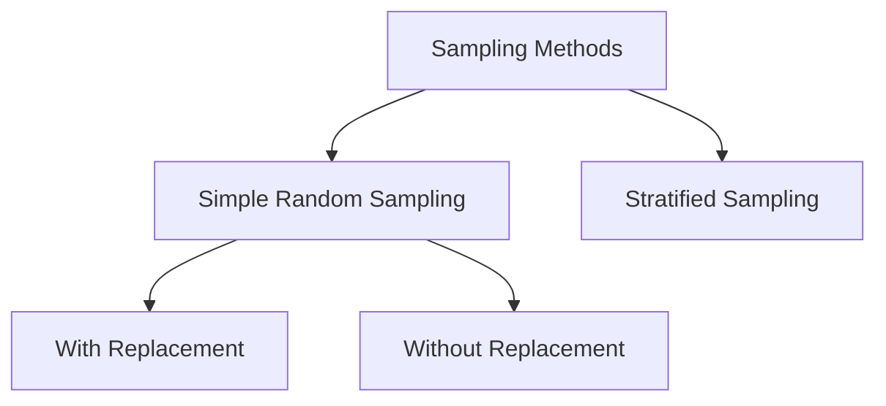

# 7.1.6. Types of Sampling Methods

The mathematical approach to selecting tuples divides sampling into two broad algorithmic categories.

The following table categorizes the primary methods used in active statistical practice.

| Sampling Category | Specific Subtype | Core Focus |
|----------|----------|----------|
| Simple Random Sampling | With Replacement | Absolute Independence |
| Simple Random Sampling | Without Replacement | Absolute Diversity |
| Stratified Sampling | Proportionate Allocation | Subgroup Representation |

Each method applies different strict constraints to how the specific subset is populated.

<!-- NAVIGATION FOOTER START -->
 

---

[ **Previous File:** 7.1.05. Practical Considerations in Sampling](./7.1.05.%20Practical%20Considerations%20in%20Sampling.md) &nbsp;&nbsp;&nbsp;&nbsp;&nbsp;&nbsp; [ **Next File:** 7.1.07. Simple Random Sampling](./7.1.07.%20Simple%20Random%20Sampling.md)

<!-- NAVIGATION FOOTER END -->