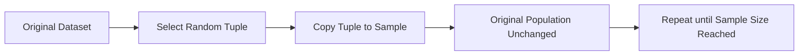

# 7.1.9. Simple Random Sampling With Replacement (SRSWR)

### 9.1 Core Idea

Sampling with replacement takes the exact opposite mechanical approach to population management.

>[!Note]
> Selected tuples are copied into the sample but are NOT removed from the original dataset.

Because the tuple is conceptually placed back into the pool, the exact same tuple may easily appear multiple times in the final resulting sample.

### 9.2 Constant Probability Property

Since tuples are never permanently removed, the population size remains completely static across time.

Consequently, the baseline probability formula:

$$
P(\text{selection}) = \frac{1}{N}
$$

remains absolutely constant across all iterations. We repeat this fundamental rule because it defines the entire method:

$$
P(\text{selection}) = \frac{1}{N}
$$

If the initial population size is:

$$
N = 8
$$

Then the probability during the first iteration is strictly:

$$
P(\text{selection}) = \frac{1}{8}
$$

And during the one-thousandth iteration, it firmly continues using:

$$
P(\text{selection}) = \frac{1}{8}
$$

### 9.3 Step-by-Step Example of SRSWR

To demonstrate the distinct possibility of duplication, we will step through a replacement sequence.

Suppose:
- Original dataset tuples = A, B, C, D, E
- Initial population size = 5
- Required sample size = 3

### Step 1: Calculate Initial Probability
$$ P(\text{selection}) = \frac{1}{5} = 0.20 $$

### Step 2: Perform First Selection
Tuple B is randomly selected and copied

### Step 3: Replace First Selection
Tuple B is returned to the pool, making the population size remain 5

### Step 4: Perform Second Selection
$$ P(\text{selection}) = \frac{1}{5} = 0.20 $$

### Step 5: Perform Final Selection
Tuple B is randomly selected again resulting in Final Sample {B, D, B}

### 9.4 Characteristics of SRSWR

The lack of tuple removal fundamentally alters the mathematical properties of the resulting subset.

The following table summarizes the deterministic behavior of simple random sampling with replacement.

| Property | Expected Behavior | Mathematical Reason |
|----------|----------|----------|
| Duplicate Tuples | Entirely Possible | Items are functionally replaced |
| Population Size | Strictly Constant | Original N remains N |
| Selection Probability | Strictly Constant | The denominator is totally fixed |

This method behaves identically to repeated, entirely independent probabilistic coin flips.

<!-- NAVIGATION FOOTER START -->
 

---

[ **Previous File:** 7.1.08. Simple Random Sampling Without Replacement (SRSWOR)](./7.1.08.%20Simple%20Random%20Sampling%20Without%20Replacement%20%28SRSWOR%29.md) &nbsp;&nbsp;&nbsp;&nbsp;&nbsp;&nbsp; [ **Next File:** 7.1.10. Comparing With vs Without Replacement](./7.1.10.%20Comparing%20With%20vs%20Without%20Replacement.md)

<!-- NAVIGATION FOOTER END -->