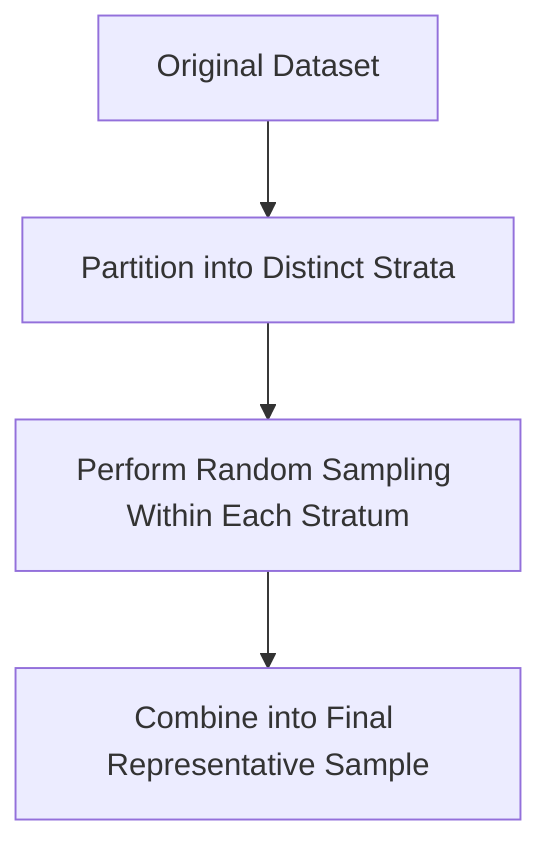

# 7.1.11. Stratified Sampling

### 11.1 Core Idea

Simple random sampling, while mathematically unbiased, is completely blind to underlying group structures. Stratified sampling proactively preserves specific subgroup distributions during the overall reduction process.

Instead of blindly selecting tuples entirely at random, the complete dataset is deliberately partitioned into non-overlapping subgroups called strata.

### 11.2 Maintaining Distribution

The primary mathematical imperative of stratified sampling is maintaining exact internal group ratios.

>[!Tip]
> The proportional distribution of subgroups must remain approximately identical between the original dataset and the newly created final sample.

Suppose an original dataset of human subjects contains the following demographic breakdown.

| Demographic Category | Original Dataset Count | True Population Proportion |
|----------|----------|----------|
| Youth | 400 | 28.5% |
| Middle Age | 800 | 57.1% |
| Senior | 200 | 14.4% |

If a data scientist arbitrarily executes pure random sampling, they might accidentally select zero seniors due to raw probability. Stratified sampling algorithmically prevents this exact scenario by mathematically enforcing the proportions in the final subset.

### 11.3 Strata Formation

To accomplish this structurally, each mutually exclusive subgroup becomes a separate, heavily isolated stratum.

Sampling is then deliberately performed independently inside each localized group. This rigorous compartmentalization fully prevents severe subgroup imbalance and permanently guarantees strict minority representation.

### 11.4 Step-by-Step Example of Stratified Sampling

To demonstrate proportional mathematical allocation, we calculate exact sample targets.

Suppose:
- Total original dataset size = 1400
- Desired final sample size = 140
- Subgroup Youth = 400
- Subgroup Middle Age = 800
- Subgroup Senior = 200

### Step 1: Calculate Sampling Fraction
$$ \text{Fraction} = \frac{140}{1400} = 0.10 $$

### Step 2: Define Strata
The dataset is split into exactly three completely independent groups

### Step 3: Allocate Youth Sample
$$ 400 \times 0.10 = 40 $$

### Step 4: Allocate Middle Age Sample
$$ 800 \times 0.10 = 80 $$

### Step 5: Allocate Senior Sample
$$ 200 \times 0.10 = 20 $$

The exact proportional structure of the dataset remains rigorously preserved inside the final combined sample.
