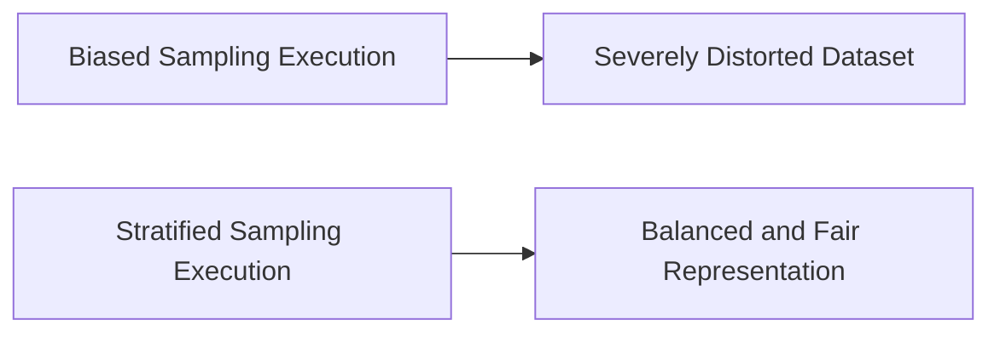

# 7.1.12. Sampling Bias and Fair Representation

Naive, purely random sampling natively generates severe statistical bias when initial datasets are highly imbalanced.

If an algorithm utilizes purely random selection on heavily skewed data:
- critical minority categories may disappear entirely
- existing skewed distributions may become mathematically extreme
- overall model fairness and equity degrade significantly

The following table explicitly shows how stratification mitigates these exact biases.

| Sampling Approach | Handling of Minorities | Final Model Equity Outcome |
|----------|----------|----------|
| Pure Random | High risk of arbitrary exclusion | Potentially Highly Biased |
| Stratified Random | Mathematical guaranteed inclusion | Proportionally Fair Representation |

