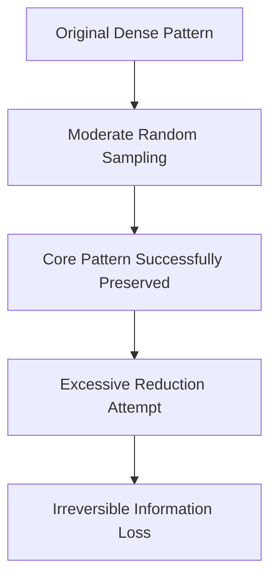

# 7.1.13. Sampling and Pattern Preservation

Preserving explicit internal geometric or statistical patterns is an incredibly important aspect of data reduction.

Suppose the original complete dataset contains exactly:

$$
N = 8000
$$

data points forming a highly visible geometric clustering structure on a scatter plot.

After applying a moderate sampling reduction, a dataset of:

$$
n = 2000
$$

points will highly likely still preserve the exact visual and mathematical boundaries of the clusters.

However, if the data engineer applies an excessive, overly aggressive reduction directly down to:

$$
n = 50
$$

points, the sampling procedure will destroy the visible cluster structure entirely, permanently rendering the data mathematically useless.

