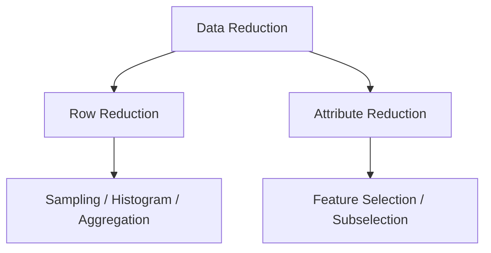
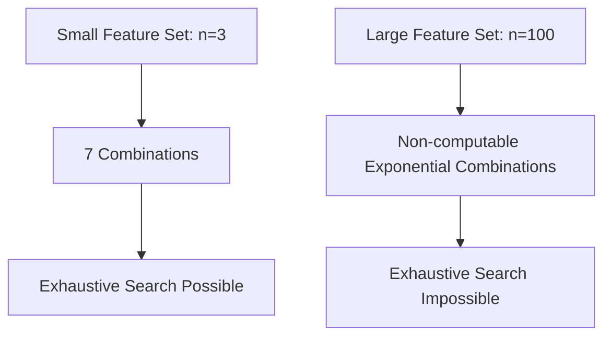
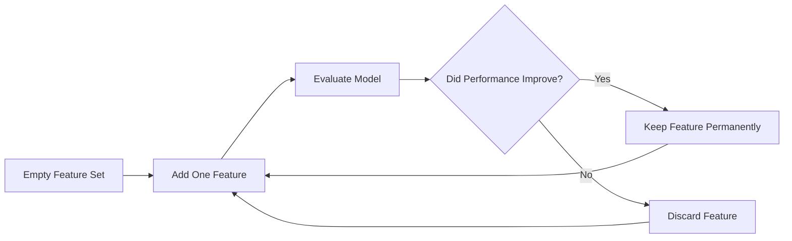
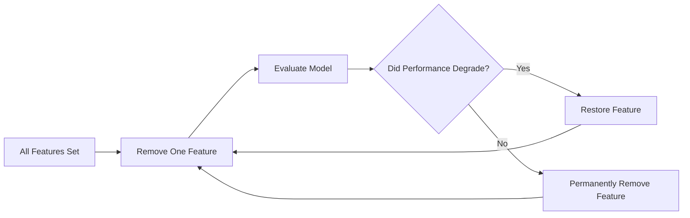
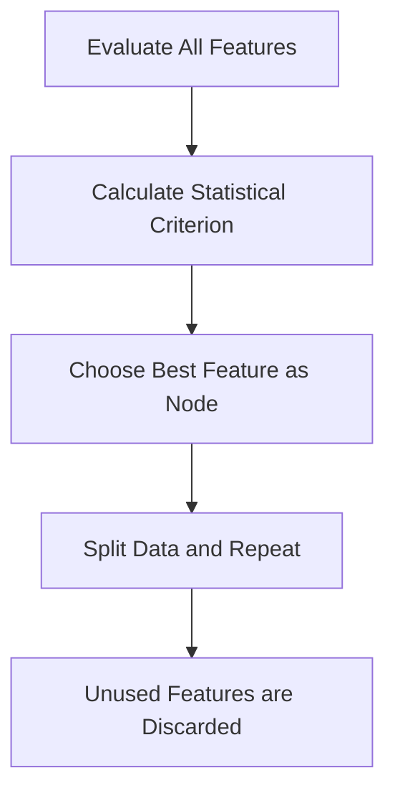
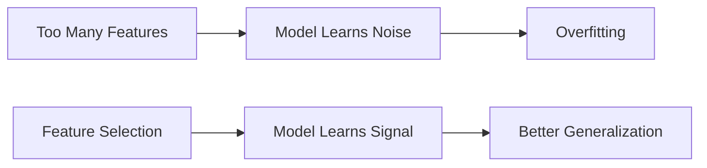

# 6.4. Attribute Subset Selection

## 6.4.1. Introduction to Attribute Subselection

Attribute subselection, also known as feature selection, is one of the most critical techniques in data preprocessing. When datasets grow massive, not all collected data provides predictive value.

The primary focus here is on reducing the number of columns, or attributes, inside a dataset while strictly preserving the most useful predictive information. 

The central idea is:

>[!Tip]
> Keep important attributes and remove unnecessary ones.

Executing this correctly improves several aspects of modeling:

- model performance
- interpretability
- computational efficiency
- generalization capability

## 6.4.2. Data Reduction and Dimensionality Reduction

To fully grasp feature selection, it is necessary to distinguish between the two major forms of data reduction. 

| Reduction Type | Meaning | Focus Area |
|----------|----------|----------|
| Row Reduction | Reduce tuples/records | `:---:` |
| Column Reduction | Reduce attributes/features | `:---:` |

Earlier topics covered row reduction techniques like histograms, sampling, and aggregation. This section focuses entirely on reducing the following metric:

$$
\text{Number of Features}
$$

Reducing this number is formally known as dimensionality reduction.

## 6.4.3. Understanding Attribute Subselection

With the context of dimensionality reduction established, we can define the specific mechanism.

>[!Tip]
> Attribute subselection is the process of identifying and retaining only relevant and informative attributes from a dataset.

Formally, the process is a mapping:

$$
\text{Original Feature Set} \rightarrow \text{Reduced Feature Set}
$$

The primary objective is to eliminate:

- irrelevant features
- redundant features
- weakly relevant features

By systematically removing these, the predictive power of the remaining dataset is preserved or even enhanced.

## 6.4.4. Relevant vs Irrelevant Features

The distinction between what to keep and what to discard begins with defining relevance. **Irrelevant attributes** are features that do not contribute meaningfully to the target prediction.

Suppose:
- The objective is to predict student CGPA
- The dataset contains multiple personal and academic variables

| Feature | Relevance | Decision |
|----------|----------|----------|
| Name | Irrelevant | `:---:` |
| Student ID | Irrelevant | `:---:` |
| City | Irrelevant | `:---:` |
| Attendance | Potentially Relevant | `:---:` |
| Study Hours | Relevant | `:---:` |

Domain experts can often identify these obviously irrelevant attributes using basic logic and common sense before any mathematical modeling begins.

## 6.4.5. Redundant Features

Even if a feature is relevant, it might not be unique. **Redundant features** contain overlapping information that is already explained by another attribute in the dataset.

Suppose:
- We have a dataset of retail products
- The dataset includes both original price and tax amount

| Attribute | Meaning | Origin |
|----------|----------|----------|
| Product Price | Original value | `:---:` |
| Tax Amount | Percentage of price | `:---:` |

If the tax rate is fixed at a specific percentage:

$$
18\%
$$

Then the tax can always be defined as:

$$
\text{Tax} = 0.18 \times \text{Price}
$$

Because these two attributes are perfectly correlated, they provide the exact same variation to the model. One of them must therefore be removed to prevent redundancy without losing any predictive information.

## 6.4.6. Why Feature Selection Matters

Eliminating irrelevance and redundancy is not just an academic exercise; it has profound practical implications. 

| Benefit | Explanation | Impact |
|----------|----------|----------|
| Better Performance | Removes statistical noise | `:---:` |
| Lower Complexity | Requires fewer computations | `:---:` |
| Better Interpretability | Results in simpler models | `:---:` |
| Reduced Overfitting | Avoids learning irrelevant patterns | `:---:` |
| Faster Training | Reduces the overall feature space | `:---:` |

Feature selection acts as a dual-purpose optimization, improving both computational efficiency and overall prediction quality.

## 6.4.7. Feature Selection as a Search Problem

To achieve these benefits, feature selection must be treated mathematically as a combinatorial search problem. 

If we represent the number of attributes as:

$$
n
$$

The total number of possible feature subsets (ignoring the empty subset) is given by the formula:

$$
2^n - 1
$$

Suppose:
- A dataset contains 3 attributes
- The attributes are named A, B, and C

The possible subsets include:

| Subset | Size | Inclusion |
|----------|----------|----------|
| A | 1 | `:---:` |
| B | 1 | `:---:` |
| C | 1 | `:---:` |
| AB | 2 | `:---:` |
| AC | 2 | `:---:` |
| BC | 2 | `:---:` |
| ABC | 3 | `:---:` |

For this dataset where:

$$
n = 3
$$

The total number of subsets is exactly:

$$
2^3 - 1 = 7
$$

## 6.4.8. Subset Combination Explosion

While a 3-attribute dataset is trivial, real-world datasets cause severe scaling issues. This phenomenon is known as combinatorial explosion.

Suppose:
- A dataset has 100 features
- This means:

$$
n = 100
$$

The number of possible subsets becomes:

$$
2^{100} - 1
$$

Exhaustively evaluating every single subset in this scenario becomes computationally impossible for any modern machine.

## 6.4.9. Computational Complexity of Exhaustive Search

To understand why it is impossible, we must examine the cost of evaluating a single subset. 

For each proposed subset, the system must:
1. Build a predictive model
2. Measure its performance on validation data
3. Compare the accuracy or error to previous models

Because exhaustive search requires building a unique model for every single combination, the system would need to train exactly:

$$
2^n - 1
$$

models. This brute-force requirement forces data scientists to abandon exhaustive search for high-dimensional datasets.

## 6.4.10. Greedy Strategies in Feature Selection

Because optimal exhaustive search is impossible, we transition to heuristic approaches called greedy strategies.

>[!Tip]
> Greedy methods attempt local optimization at each step to approximate a global optimization.

Instead of evaluating every possible subset in existence, greedy strategies iteratively add or remove one feature at a time based on immediate model performance. The three major methods are Forward Selection, Backward Elimination, and Decision Tree Induction.

## 6.4.11. Forward Selection

### 11.1 Core Idea

Forward selection is an additive greedy strategy. It begins with absolute minimal complexity:

$$
0 \text{ features}
$$

From this empty set, features are added incrementally, one by one, keeping only those that improve the model.

### 11.2 Step-by-Step Workflow

Suppose:
- The available features are A, B, and C
- We start with an empty feature set
- Our goal is to maximize accuracy

### Step 1: Initialize and Add First Feature
Randomly choose the first feature, such as B. Build the model and record the baseline accuracy.

### Step 2: Add Second Feature
Add feature C to the set. Build a new model using the subset BC.

### Step 3: Evaluate Second Feature
If the accuracy of subset BC is higher than B alone, retain C. Otherwise, remove C from the active set.

### Step 4: Add Third Feature
Add feature A to the currently successful subset. Build the model and evaluate the accuracy change.

### Step 5: Terminate Search
Stop the iteration process completely when adding new features yields **no further improvement** in accuracy.

### 11.3 Accuracy-Based Selection

When implementing forward selection, accuracy is a common evaluation metric. The rule is strictly conditional:

| Accuracy Change | Decision | Result |
|----------|----------|----------|
| Accuracy Increases | Keep Feature | `:---:` |
| Accuracy Decreases | Remove Feature | `:---:` |

The overarching objective here is maximizing predictive performance.

### 11.4 Error-Based Selection

Alternatively, error metrics (like Mean Squared Error) can dictate the selection process. The rule simply reverses:

| Error Change | Decision | Result |
|----------|----------|----------|
| Error Decreases | Keep Feature | `:---:` |
| Error Increases | Remove Feature | `:---:` |

Therefore, the guiding mathematical principle is:

$$
\text{Error} \downarrow \implies \text{Better Feature Subset}
$$

## 6.4.12. Backward Elimination

### 12.1 Core Idea

If forward selection builds from nothing, backward elimination performs the exact opposite strategy. It begins with maximum complexity:

$$
\text{All Features Included}
$$

From this full set, features are removed iteratively, discarding attributes that do not harm the model's performance when absent.

### 12.2 Step-by-Step Workflow

Suppose:
- The available features are A, B, and C
- We start with the full feature set
- Our goal is to maintain maximum accuracy with minimal features

### Step 1: Build Baseline Model
Build the initial model using the complete subset ABC and record the baseline accuracy.

### Step 2: Remove First Feature
Temporarily remove feature A from the dataset. Build a new model using only subset BC.

### Step 3: Evaluate Removal
If the accuracy remains the same or improves, remove A permanently. If the accuracy drops significantly, restore A to the subset.

### Step 4: Iterate Through Remaining
Repeat the temporary removal and evaluation process for features B and C independently.

### Step 5: Terminate Search
Stop the process and output the final subset when the removal of any remaining feature causes **performance to degrade**.

## 6.4.13. Forward Selection vs Backward Elimination

Both methods are greedy heuristics, meaning neither guarantees finding the mathematically perfect optimal subset. 

| Property | Forward Selection | Backward Elimination |
|----------|----------|----------|
| Starting Point | Empty Set | Full Set |
| Operation | Add Features | Remove Features |
| Initial Complexity | Lower | Higher |
| Best Suitable For | Massive Feature Spaces | Smaller Feature Spaces |

Choosing between them depends entirely on the initial dimensionality of the dataset.

## 6.4.14. Decision Tree Induction for Feature Selection

Beyond stepwise addition or subtraction, decision tree induction serves as an embedded feature selection approach. Instead of randomly choosing which feature to test next, the algorithm selects attributes using pure statistical criteria.

The decision tree automatically prioritizes the most informative features at the top of the tree, naturally filtering out irrelevant ones.

## 6.4.15. Information Gain Concept

The primary statistical criterion used by decision trees to rank features is known as **Information Gain**. 

Features that possess higher information gain contribute more strongly toward resolving uncertainty in the target prediction. Consequently, they are selected earlier in the tree building process. 

The core mathematical intuition is simply:

$$
\text{Higher Gain} \implies \text{More Informative Feature}
$$

## 6.4.16. Overfitting and Noise Reduction

A critical secondary benefit of feature selection is its impact on model generalization. Retaining unnecessary features gives the model the opportunity to memorize accidental, noisy patterns.

Removing these weak features forces the model to learn true underlying trends.

Thus, feature selection acts as a natural regularization technique.

## 6.4.17. Role of Domain Experts

Despite the power of algorithms, human context remains invaluable. Domain expertise can bypass intensive computational searches entirely.

| Prediction Task | Obvious Irrelevant Feature | Action Required |
|----------|----------|----------|
| CGPA Prediction | Student ID | `:---:` |
| Weather Prediction | Random Username | `:---:` |
| Medical Diagnosis | Patient Last Name | `:---:` |

Human expertise complements algorithmic selection by filtering out nonsensical variables before training even begins.

## 6.4.18. Computational Efficiency Benefits

Returning to the computational perspective, reducing dimensionality guarantees an improvement in system efficiency. 

The fundamental relationship is:

$$
\text{Features} \downarrow \implies \text{Computation} \downarrow
$$

The downstream benefits of this relationship include:
- significantly lower memory usage
- drastically faster training times
- simpler models for production deployment
- lower inference costs in cloud environments

This scaling becomes extremely important in high-dimensional enterprise systems.

## 6.4.19. Practical Challenges in Feature Selection

While highly beneficial, implementing feature selection introduces unavoidable trade-offs.

| Challenge | Fundamental Problem | Risk Severity |
|----------|----------|----------|
| Combinatorial Explosion | Too many possible subsets to check | `:---:` |
| Greedy Limitation | High risk of settling on local optimums | `:---:` |
| Feature Interaction | Important synergistic combinations missed | `:---:` |
| Computational Cost | Repeated model training during search | `:---:` |

>[!Warning]
> Greedy methods reduce complexity but they fundamentally do not guarantee globally optimal subsets.

A feature that performs poorly on its own might be highly predictive when combined with another feature, a dynamic that simple stepwise selection often misses.

## 6.4.20. Key Takeaways

Attribute subselection is a mandatory dimensionality reduction technique for modern machine learning, focusing heavily on identifying the most informative attributes.

To summarize, the process relies on purging three types of features:
- irrelevant features
- redundant features
- weak predictors

The major algorithmic methods for achieving this are:

| Method Type | Core Action |
|----------|----------|
| Forward Selection | Add iteratively |
| Backward Elimination | Remove iteratively |
| Decision Tree Induction | Select by Information Gain |

Ultimately, the most important conceptual insight is that feature selection is always a balancing act:

$$
\text{Prediction Quality} \quad vs \quad \text{Computational Complexity}
$$

Executing good feature selection guarantees improved model interpretability, minimizes overfitting risks, accelerates training pipelines, and yields fundamentally cleaner statistical models.
