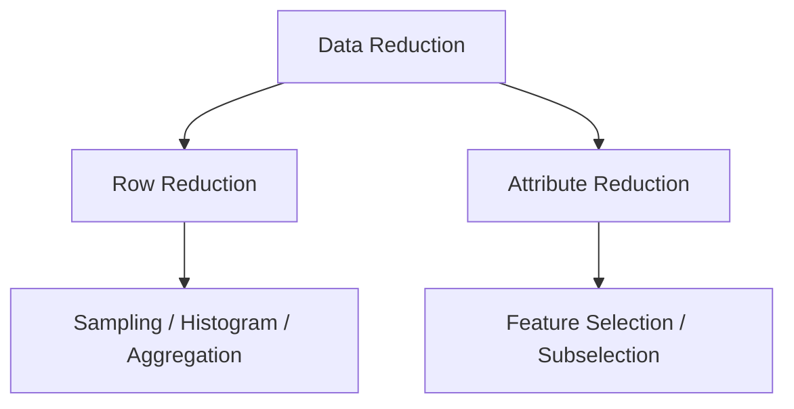

# 6.4.2. Data Reduction and Dimensionality Reduction

To fully grasp feature selection, it is necessary to distinguish between the two major forms of data reduction.

| Reduction Type | Meaning | Focus Area |
|----------|----------|----------|
| Row Reduction | Reduce tuples/records | Sampling and Aggregation |
| Column Reduction | Reduce attributes/features | Feature Selection |

Earlier topics covered row reduction techniques like histograms, sampling, and aggregation. This section focuses entirely on reducing the following metric:

$$
\text{Number of Features}
$$

Reducing this number is formally known as dimensionality reduction.

<!-- NAVIGATION FOOTER START -->
 

---

[ **Previous File:** 6.4.01. Introduction to Attribute Subselection](./6.4.01.%20Introduction%20to%20Attribute%20Subselection.md) &nbsp;&nbsp;&nbsp;&nbsp;&nbsp;&nbsp; [ **Next File:** 6.4.03. Understanding Attribute Subselection](./6.4.03.%20Understanding%20Attribute%20Subselection.md)

<!-- NAVIGATION FOOTER END -->