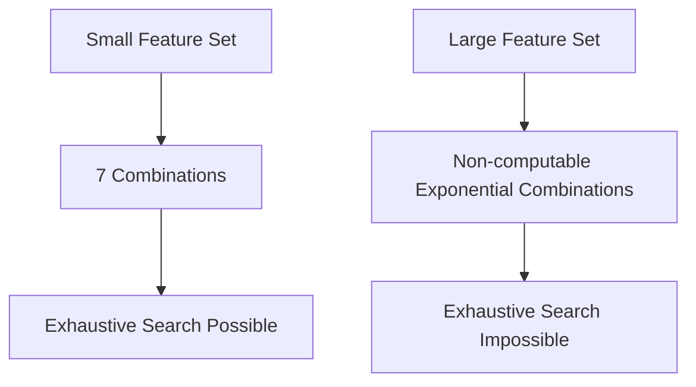

# 6.4.8. Subset Combination Explosion

While a 3-attribute dataset is trivial, real-world datasets cause severe scaling issues. This phenomenon is known as combinatorial explosion.

Suppose:
- A dataset has 100 features

This means:

$$
n = 100
$$

The number of possible subsets becomes:

$$
2^{100} - 1
$$

Exhaustively evaluating every single subset in this scenario becomes computationally impossible for any modern machine.
