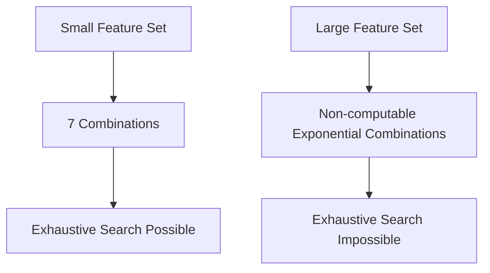

# 6.4.8. Subset Combination Explosion

While a 3-attribute dataset is trivial, real-world datasets cause severe scaling issues. This phenomenon is known as combinatorial explosion.

Suppose:
- A dataset has 100 features

This means:

$$
n = 100
$$

The number of possible subsets becomes:

$$
2^{100} - 1
$$

Exhaustively evaluating every single subset in this scenario becomes computationally impossible for any modern machine.

<!-- NAVIGATION FOOTER START -->
 

---

[ **Previous File:** 6.4.07. Feature Selection as a Search Problem](./6.4.07.%20Feature%20Selection%20as%20a%20Search%20Problem.md) &nbsp;&nbsp;&nbsp;&nbsp;&nbsp;&nbsp; [ **Next File:** 6.4.09. Computational Complexity of Exhaustive Search](./6.4.09.%20Computational%20Complexity%20of%20Exhaustive%20Search.md)

<!-- NAVIGATION FOOTER END -->