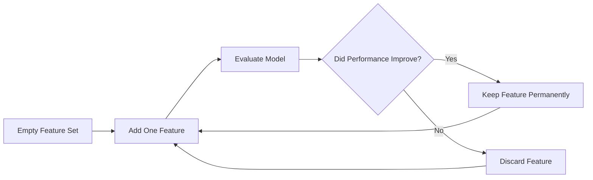

# 6.4.11. Forward Selection

### 11.1 Core Idea

Forward selection is an additive greedy strategy. It begins with absolute minimal complexity:

$$
0 \text{ features}
$$

From this empty set, features are added incrementally, one by one, keeping only those that improve the model.

### 11.2 Step-by-Step Workflow

Suppose:
- The available features are A, B, and C
- We start with an empty feature set
- Our goal is to maximize accuracy

### Step 1: Initialize First Feature
Select B and measure baseline accuracy

### Step 2: Add Second Feature
Build new model using subset BC

### Step 3: Evaluate Second Feature
Retain C if accuracy improves

### Step 4: Add Third Feature
Build new model using subset ABC

### Step 5: Terminate Search
Stop when accuracy no longer improves

### 11.3 Accuracy-Based Selection

When implementing forward selection, accuracy is a common evaluation metric. The rule is strictly conditional:

| Accuracy Change | Decision | Resulting Action |
|----------|----------|----------|
| Accuracy Increases | Keep Feature | Subset Expands |
| Accuracy Decreases | Remove Feature | Subset Unchanged |

The overarching objective here is maximizing predictive performance.

### 11.4 Error-Based Selection

Alternatively, error metrics (like Mean Squared Error) can dictate the selection process. The rule simply reverses:

| Error Change | Decision | Model State |
|----------|----------|----------|
| Error Decreases | Keep Feature | Optimized |
| Error Increases | Remove Feature | Reverted |

Therefore, the guiding mathematical principle is:

$$
\text{Error} \downarrow \implies \text{Better Feature Subset}
$$

<!-- NAVIGATION FOOTER START -->
 

---

[ **Previous File:** 6.4.10. Greedy Strategies in Feature Selection](./6.4.10.%20Greedy%20Strategies%20in%20Feature%20Selection.md) &nbsp;&nbsp;&nbsp;&nbsp;&nbsp;&nbsp; [ **Next File:** 6.4.12. Backward Elimination](./6.4.12.%20Backward%20Elimination.md)

<!-- NAVIGATION FOOTER END -->