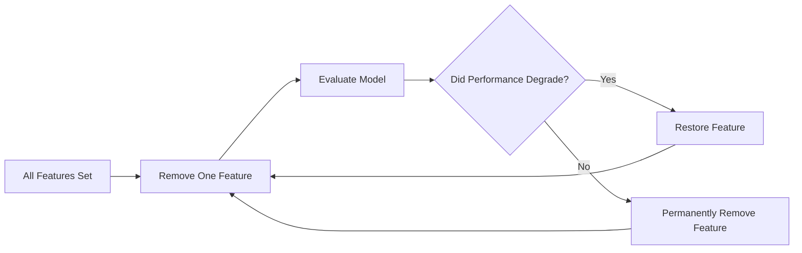

# 6.4.12. Backward Elimination

### 12.1 Core Idea

If forward selection builds from nothing, backward elimination performs the exact opposite strategy. It begins with maximum complexity:

$$
\text{All Features Included}
$$

From this full set, features are removed iteratively, discarding attributes that do not harm the model's performance when absent.

### 12.2 Step-by-Step Workflow

Suppose:
- The available features are A, B, and C
- We start with the full feature set
- Our goal is to maintain maximum accuracy with minimal features

### Step 1: Build Baseline Model
Use complete subset ABC

### Step 2: Remove First Feature
Build new model using subset BC

### Step 3: Evaluate Removal
Permanently remove A if accuracy improves

### Step 4: Iterate Remaining Features
Test removal of B and C independently

### Step 5: Terminate Search
Stop when removal degrades performance

<!-- NAVIGATION FOOTER START -->
 

---

[ **Previous File:** 6.4.11. Forward Selection](./6.4.11.%20Forward%20Selection.md) &nbsp;&nbsp;&nbsp;&nbsp;&nbsp;&nbsp; [ **Next File:** 6.4.13. Forward Selection vs Backward Elimination](./6.4.13.%20Forward%20Selection%20vs%20Backward%20Elimination.md)

<!-- NAVIGATION FOOTER END -->