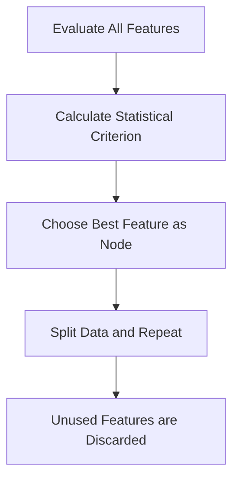

# 6.4.14. Decision Tree Induction for Feature Selection

Beyond stepwise addition or subtraction, decision tree induction serves as an embedded feature selection approach. Instead of randomly choosing which feature to test next, the algorithm selects attributes using pure statistical criteria.

The decision tree automatically prioritizes the most informative features at the top of the tree, naturally filtering out irrelevant ones.

<!-- NAVIGATION FOOTER START -->
 

---

[ **Previous File:** 6.4.13. Forward Selection vs Backward Elimination](./6.4.13.%20Forward%20Selection%20vs%20Backward%20Elimination.md) &nbsp;&nbsp;&nbsp;&nbsp;&nbsp;&nbsp; [ **Next File:** 6.4.15. Information Gain Concept](./6.4.15.%20Information%20Gain%20Concept.md)

<!-- NAVIGATION FOOTER END -->