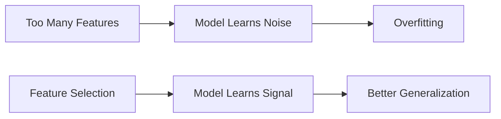

# 6.4.16. Overfitting and Noise Reduction

A critical secondary benefit of feature selection is its impact on model generalization. Retaining unnecessary features gives the model the opportunity to memorize accidental, noisy patterns.

Removing these weak features forces the model to learn true underlying trends.

Thus, feature selection acts as a natural regularization technique.
